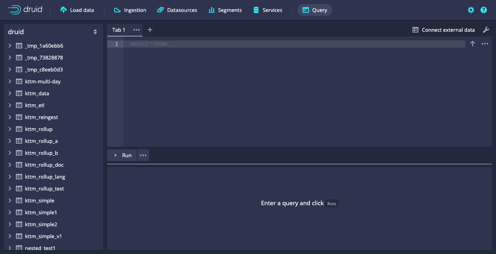

> The multi-stage query engine is an alpha feature available in Imply 2022.01 and later. All
> functionality documented on this page is subject to change or removal at any time. Alpha features
> are provided "as is" and are not subject to Imply SLAs.

The Multi-Stage Query Engine (MSQE) is a multi-stage distributed query engine for Apache Druid that extends Druid's query capabilities. MSQE has  the same query capabilities as the existing core Druid query engine but provides additional benefits. It supports larger, heavier-weight queries, querying external data, and ingestion through SQL INSERT and REPLACE queries. MSQE excels at executing queries that can get bottlenecked at the Broker when using Druid's core query engine.

MSQE splits queries into stages and automatically exchanges data between stages. Each stage is parallelized to run across multiple data servers at once, simplifying performance.

With MSQE, you can use Druid to:

- Read external data at query time using [EXTERN](#extern).
- Execute batch ingestion jobs as SQL queries using [INSERT](#insert) and [REPLACE](#replace). You no longer need to generate a JSON-based ingestion spec.
- Transform and rewrite existing tables using SQL queries.
- Execute heavy-weight queries that might run for a long time and return large numbers of rows.
- Execute queries that exchange large amounts of data between servers, like exact count
  distinct of high-cardinality fields.
- Perform multi-dimension range partitioning reliably, leading to segment sizes being distributed more evenly and better performance.

You can read more about the motivation for building MSQE in this [Imply blog post](https://imply.io/blog/a-new-shape-for-apache-druid/).

The engine is code-named "Talaria". During the alpha, you'll see this term in certain API calls, properties, and
in the name of the extension. The name comes from Mercury’s winged sandals, representing the
exchange of data between servers.


## Prerequisites

To use MSQE, make sure you meet the following requirements:

- An Imply Enterprise or Enterprise Hybrid cluster that runs version 2022.01 STS or later. Imply recommends using the latest STS version. Note that the feature isn't available in an LTS release yet. 
- A license that has an entitlement for the multi-stage query engine. The `features` section of your license string must contain the `talaria` snippet.
- Administrator access to Imply Manager so that you can enable the required extension. For security information related to data sources, see [Security](#security)

## Setup

Turning the multi-stage query engine on is a two-part process:

1. [Enable the engine in Imply Manager](#enable-the-multi-stage-query-engine-in-imply-manager).
2. [Enable an enhanced version Query view in the Druid console](#enable-the-enhanced-query-view).

### Enable the multi-stage query engine in Imply Manager

In Imply Manager, perform the following steps to enable the multi-stage query engine:

1. Go to **Clusters > Manage** for the cluster you want to enable the feature on. You enable the multi-stage query engine on each cluster .
2. Go to **Setup** and expand the **Advanced config** options.
3. Add the following custom extension:

   - **Name**: `imply-talaria`
   - **S3 path or url**: Leave this blank. This extension is bundled with the Imply distribution.

4. Change the following feature flags by clicking the pencil icon:

   - Select **HTTP-based task management**. 
   - Clear **Use Indexers instead of Middle Managers**.

   Although these features aren't required for the multi-stage query engine, they can improve performance.


5. Add the following **Service properties**:

   **Common** service properties include your multi-stage query engine entitled license:

   ```bash
   imply.license=<license string>
   ```

   **Middle Manager** service properties configure how Middle Managers execute tasks. You can change the sample values provided in this quickstart to match your usage.

   ```bash
   # Set this property to the maximum number of tasks per job plus 25.
   # The upper limit for tasks per job is 1000, so 1000 + 25.
   # Set this lower if you do not intend to use this many tasks.
   druid.indexer.fork.property.druid.server.http.numThreads=1025
   
   # Lazy initialization of the connection pool that used for shuffle.
   druid.global.http.numConnections=50
   druid.global.http.eagerInitialization=false
   
   # Required for Java 11
   jvm.config.dsmmap=--add-exports=java.base/jdk.internal.ref=ALL-UNNAMED
   druid.indexer.runner.javaOptsArray=["--add-exports=java.base/jdk.internal.ref=ALL-UNNAMED"]
   ```

   **Broker** service properties control how the Broker routes queries. Set your SQL executor to `imply`.

   ```bash
   druid.sql.executor.type=imply
   ```

### Enable the enhanced Query view

To use MSQE with the Druid console, enable the enhanced version of the Query view:

1. Open the Druid console. You can select **Manage data** in Imply Manager or **Open Druid console** in Pivot.
2. Option (or alt) click on the Druid logo to enable the enhanced Query view.

   If an error related to missing extensions occurs, verify that the properties you set in **Advanced configs** match the ones in [Enable multi-stage query engine](#enable-the-multi-stage-query-engine-in-imply-manager).

3. Go to the **Query** tab. 
4. Click the ellipsis (...) next to **Run**.
5. For **Query engine**, select **sql-task**. If you don't see **Query engine** in the menu, you need to option (or alt) click the Druid logo to enable the view.

You're ready to start running queries using the multi-stage query engine.

## Run queries

The best way to start running multi-stage queries is with the enhanced query view
in the Druid web console.



Run the following query to try the multi-stage query engine with external sample data.

```sql
SELECT *
FROM TABLE(
  EXTERN(
    '{"type": "http", "uris": ["https://static.imply.io/gianm/wikipedia-2016-06-27-sampled.json"]}',
    '{"type": "json"}',
    '[{"name": "added", "type": "long"}, {"name": "channel", "type": "string"}, {"name": "cityName", "type": "string"}, {"name": "comment", "type": "string"}, {"name": "commentLength", "type": "long"}, {"name": "countryIsoCode", "type": "string"}, {"name": "countryName", "type": "string"}, {"name": "deleted", "type": "long"}, {"name": "delta", "type": "long"}, {"name": "deltaBucket", "type": "string"}, {"name": "diffUrl", "type": "string"}, {"name": "flags", "type": "string"}, {"name": "isAnonymous", "type": "string"}, {"name": "isMinor", "type": "string"}, {"name": "isNew", "type": "string"}, {"name": "isRobot", "type": "string"}, {"name": "isUnpatrolled", "type": "string"}, {"name": "metroCode", "type": "string"}, {"name": "namespace", "type": "string"}, {"name": "page", "type": "string"}, {"name": "regionIsoCode", "type": "string"}, {"name": "regionName", "type": "string"}, {"name": "timestamp", "type": "string"}, {"name": "user", "type": "string"}]'
  )
)
LIMIT 100
```

The multi-stage query engine allows querying external data with the [`EXTERN`](#extern) function.

To ingest the query results into a table, run the following query.

```sql
INSERT INTO wikipedia
SELECT
  TIME_PARSE("timestamp") AS __time,
  *
FROM TABLE(
  EXTERN(
    '{"type": "http", "uris": ["https://static.imply.io/gianm/wikipedia-2016-06-27-sampled.json"]}',
    '{"type": "json"}',
    '[{"name": "added", "type": "long"}, {"name": "channel", "type": "string"}, {"name": "cityName", "type": "string"}, {"name": "comment", "type": "string"}, {"name": "commentLength", "type": "long"}, {"name": "countryIsoCode", "type": "string"}, {"name": "countryName", "type": "string"}, {"name": "deleted", "type": "long"}, {"name": "delta", "type": "long"}, {"name": "deltaBucket", "type": "string"}, {"name": "diffUrl", "type": "string"}, {"name": "flags", "type": "string"}, {"name": "isAnonymous", "type": "string"}, {"name": "isMinor", "type": "string"}, {"name": "isNew", "type": "string"}, {"name": "isRobot", "type": "string"}, {"name": "isUnpatrolled", "type": "string"}, {"name": "metroCode", "type": "string"}, {"name": "namespace", "type": "string"}, {"name": "page", "type": "string"}, {"name": "regionIsoCode", "type": "string"}, {"name": "regionName", "type": "string"}, {"name": "timestamp", "type": "string"}, {"name": "user", "type": "string"}]'
  )
)
PARTITIONED BY DAY
```

The query returns information including the number of rows inserted into the table named "wikipedia" and how long the query took.

The `PARTITIONED BY DAY` clause specifies day-based segment granularity. The
data is inserted into the `wikipedia` table.

The data is now queryable. Run the following query to analyze the data
in the ingested table, producing a list of top channels.

```sql
SELECT
  channel,
  COUNT(*)
FROM wikipedia
GROUP BY channel
ORDER BY COUNT(*) DESC
```

The same query would also work on the external data directly.

```sql
SELECT
  channel,
  COUNT(*)
FROM TABLE(
  EXTERN(
    '{"type": "http", "uris": ["https://static.imply.io/gianm/wikipedia-2016-06-27-sampled.json"]}',
    '{"type": "json"}',
    '[{"name": "added", "type": "long"}, {"name": "channel", "type": "string"}, {"name": "cityName", "type": "string"}, {"name": "comment", "type": "string"}, {"name": "commentLength", "type": "long"}, {"name": "countryIsoCode", "type": "string"}, {"name": "countryName", "type": "string"}, {"name": "deleted", "type": "long"}, {"name": "delta", "type": "long"}, {"name": "deltaBucket", "type": "string"}, {"name": "diffUrl", "type": "string"}, {"name": "flags", "type": "string"}, {"name": "isAnonymous", "type": "string"}, {"name": "isMinor", "type": "string"}, {"name": "isNew", "type": "string"}, {"name": "isRobot", "type": "string"}, {"name": "isUnpatrolled", "type": "string"}, {"name": "metroCode", "type": "string"}, {"name": "namespace", "type": "string"}, {"name": "page", "type": "string"}, {"name": "regionIsoCode", "type": "string"}, {"name": "regionName", "type": "string"}, {"name": "timestamp", "type": "string"}, {"name": "user", "type": "string"}]'
  )
)
GROUP BY channel
ORDER BY COUNT(*) DESC
```

For more examples, see the [Example queries](#example-queries) section.

## Example queries

You can copy the example queries into the **Query** UI.

### INSERT with no rollup <a href="#example-insert" name="example-insert">#</a>

<details><summary>Show the query</summary>

```sql
--:context talariaFinalizeAggregations: false
--:context groupByEnableMultiValueUnnesting: false

INSERT INTO w000
SELECT
  TIME_PARSE("timestamp") AS __time,
  *
FROM TABLE(
    EXTERN(
      '{"type": "http", "uris": ["https://static.imply.io/gianm/wikipedia-2016-06-27-sampled.json"]}',
      '{"type": "json"}',
      '[{"name": "added", "type": "long"}, {"name": "channel", "type": "string"}, {"name": "cityName", "type": "string"}, {"name": "comment", "type": "string"}, {"name": "commentLength", "type": "long"}, {"name": "countryIsoCode", "type": "string"}, {"name": "countryName", "type": "string"}, {"name": "deleted", "type": "long"}, {"name": "delta", "type": "long"}, {"name": "deltaBucket", "type": "string"}, {"name": "diffUrl", "type": "string"}, {"name": "flags", "type": "string"}, {"name": "isAnonymous", "type": "string"}, {"name": "isMinor", "type": "string"}, {"name": "isNew", "type": "string"}, {"name": "isRobot", "type": "string"}, {"name": "isUnpatrolled", "type": "string"}, {"name": "metroCode", "type": "string"}, {"name": "namespace", "type": "string"}, {"name": "page", "type": "string"}, {"name": "regionIsoCode", "type": "string"}, {"name": "regionName", "type": "string"}, {"name": "timestamp", "type": "string"}, {"name": "user", "type": "string"}]'
    )
  )
PARTITIONED BY HOUR
CLUSTERED BY channel
```

</details>

### INSERT with rollup <a href="#example-insert-rollup" name="example-insert-rollup">#</a>

<details><summary>Show the query</summary>

```sql
--:context talariaFinalizeAggregations: false
--:context groupByEnableMultiValueUnnesting: false

INSERT INTO "kttm_rollup"

WITH kttm_data AS (
SELECT * FROM TABLE(
  EXTERN(
    '{"type":"http","uris":["https://static.imply.io/data/kttm/kttm-v2-2019-08-25.json.gz"]}',
    '{"type":"json"}',
    '[{"name":"timestamp","type":"string"},{"name":"agent_category","type":"string"},{"name":"agent_type","type":"string"},{"name":"browser","type":"string"},{"name":"browser_version","type":"string"},{"name":"city","type":"string"},{"name":"continent","type":"string"},{"name":"country","type":"string"},{"name":"version","type":"string"},{"name":"event_type","type":"string"},{"name":"event_subtype","type":"string"},{"name":"loaded_image","type":"string"},{"name":"adblock_list","type":"string"},{"name":"forwarded_for","type":"string"},{"name":"language","type":"string"},{"name":"number","type":"long"},{"name":"os","type":"string"},{"name":"path","type":"string"},{"name":"platform","type":"string"},{"name":"referrer","type":"string"},{"name":"referrer_host","type":"string"},{"name":"region","type":"string"},{"name":"remote_address","type":"string"},{"name":"screen","type":"string"},{"name":"session","type":"string"},{"name":"session_length","type":"long"},{"name":"timezone","type":"string"},{"name":"timezone_offset","type":"long"},{"name":"window","type":"string"}]'
  )
))

SELECT
  FLOOR(TIME_PARSE("timestamp") TO MINUTE) AS __time,
  session,
  agent_category,
  agent_type,
  browser,
  browser_version,
  MV_TO_ARRAY("language") AS "language", -- Multi-value string dimension
  os,
  city,
  country,
  forwarded_for AS ip_address,

  COUNT(*) AS "cnt",
  SUM(session_length) AS session_length,
  APPROX_COUNT_DISTINCT_DS_HLL(event_type) AS unique_event_types
FROM kttm_data
WHERE os = 'iOS'
GROUP BY 1, 2, 3, 4, 5, 6, 7, 8, 9, 10, 11
PARTITIONED BY HOUR
CLUSTERED BY browser, session
```

</details>

### INSERT for reindexing an existing datasource <a href="#example-reindexing" name="example-reindexing">#</a>

This query rolls up data from w000 and inserts the result into w002.

<details><summary>Show the query</summary>

```sql
--:context talariaFinalizeAggregations: false
--:context groupByEnableMultiValueUnnesting: false

INSERT INTO w002
SELECT
  FLOOR(__time TO MINUTE) AS __time,
  channel,
  countryIsoCode,
  countryName,
  regionIsoCode,
  regionName,
  page,
  COUNT(*) AS cnt,
  SUM(added) AS sum_added,
  SUM(deleted) AS sum_deleted
FROM w000
GROUP BY 1, 2, 3, 4, 5, 6, 7
PARTITIONED BY HOUR
CLUSTERED BY page
```

</details>

### INSERT for reindexing an existing datasource into itself <a href="#example-self-reindexing" name="example-self-reindexing">#</a>

This query rolls up data for a specific day from w000, and does an insert-with-replacement into the
same table. Note that the `sqlReplaceTimeChunks` context parameter matches the WHERE filter.

<details><summary>Show the query</summary>

```sql
--:context sqlReplaceTimeChunks: 2031-01-02/2031-01-03
--:context talariaFinalizeAggregations: false
--:context groupByEnableMultiValueUnnesting: false

INSERT INTO w000
SELECT
  FLOOR(__time TO MINUTE) AS __time,
  channel,
  countryIsoCode,
  countryName,
  regionIsoCode,
  regionName,
  page,
  COUNT(*) AS cnt,
  SUM(added) AS sum_added,
  SUM(deleted) AS sum_deleted
FROM w000
WHERE
  __time >= TIMESTAMP '2031-01-02 00:00:00'
  AND __time < TIMESTAMP '2031-01-03 00:00:00'
GROUP BY 1, 2, 3, 4, 5, 6, 7
PARTITIONED BY HOUR
CLUSTERED BY page
```

</details>

### INSERT with JOIN <a href="#example-insert-join" name="example-insert-join">#</a>


<details><summary>Show the query</summary>

```sql
--:context talariaFinalizeAggregations: false
--:context groupByEnableMultiValueUnnesting: false

INSERT INTO w003
WITH wikidata AS (
  SELECT * FROM TABLE(
    EXTERN(
      '{"type": "http", "uris": ["https://static.imply.io/gianm/wikipedia-2016-06-27-sampled.json"]}',
      '{"type": "json"}',
      '[{"name": "added", "type": "long"}, {"name": "channel", "type": "string"}, {"name": "cityName", "type": "string"}, {"name": "comment", "type": "string"}, {"name": "commentLength", "type": "long"}, {"name": "countryIsoCode", "type": "string"}, {"name": "countryName", "type": "string"}, {"name": "deleted", "type": "long"}, {"name": "delta", "type": "long"}, {"name": "deltaBucket", "type": "string"}, {"name": "diffUrl", "type": "string"}, {"name": "flags", "type": "string"}, {"name": "isAnonymous", "type": "string"}, {"name": "isMinor", "type": "string"}, {"name": "isNew", "type": "string"}, {"name": "isRobot", "type": "string"}, {"name": "isUnpatrolled", "type": "string"}, {"name": "metroCode", "type": "string"}, {"name": "namespace", "type": "string"}, {"name": "page", "type": "string"}, {"name": "regionIsoCode", "type": "string"}, {"name": "regionName", "type": "string"}, {"name": "timestamp", "type": "string"}, {"name": "user", "type": "string"}]'
    )
  )
),

countries AS (
  SELECT * FROM TABLE(
    EXTERN(
      '{"type": "http", "uris": ["https://static.imply.io/lookup/country.tsv"]}',
      '{"type": "tsv", "hasHeaderRow": true}',
      '[{ "name": "Country", "type": "string" },{ "name": "Capital", "type": "string" },{ "name": "ISO3", "type": "string" },{ "name": "ISO2", "type": "string" }]'
    )
  )
)

SELECT
  TIME_PARSE(wikidata."timestamp") AS __time,
  wikidata.*,
  countries.Capital AS countryCapital
FROM wikidata
LEFT JOIN countries ON wikidata.countryIsoCode = countries.ISO2
PARTITIONED BY HOUR
```

</details>

### REPLACE an entire datasource

Replaces the entire datasource with the new query data. The old data gets dropped.

<details><summary>Show the query</summary>

```sql
--:context talariaFinalizeAggregations: false
--:context groupByEnableMultiValueUnnesting: false

REPLACE INTO w007
OVERWRITE ALL
SELECT
  TIME_PARSE("timestamp") AS __time,
  *
FROM TABLE(
    EXTERN(
      '{"type": "http", "uris": ["https://static.imply.io/gianm/wikipedia-2016-06-27-sampled.json"]}',
      '{"type": "json"}',
      '[{"name": "added", "type": "long"}, {"name": "channel", "type": "string"}, {"name": "cityName", "type": "string"}, {"name": "comment", "type": "string"}, {"name": "commentLength", "type": "long"}, {"name": "countryIsoCode", "type": "string"}, {"name": "countryName", "type": "string"}, {"name": "deleted", "type": "long"}, {"name": "delta", "type": "long"}, {"name": "deltaBucket", "type": "string"}, {"name": "diffUrl", "type": "string"}, {"name": "flags", "type": "string"}, {"name": "isAnonymous", "type": "string"}, {"name": "isMinor", "type": "string"}, {"name": "isNew", "type": "string"}, {"name": "isRobot", "type": "string"}, {"name": "isUnpatrolled", "type": "string"}, {"name": "metroCode", "type": "string"}, {"name": "namespace", "type": "string"}, {"name": "page", "type": "string"}, {"name": "regionIsoCode", "type": "string"}, {"name": "regionName", "type": "string"}, {"name": "timestamp", "type": "string"}, {"name": "user", "type": "string"}]'
    )
  )
PARTITIONED BY HOUR
CLUSTERED BY channel
```

</details>

### REPLACE for replacing a specific time segment

Replaces certain segments in a datasource with the new query data. The old segments gets dropped.

<details><summary>Show the query</summary>

```sql
--:context talariaFinalizeAggregations: false
--:context groupByEnableMultiValueUnnesting: false

REPLACE INTO w007
OVERWRITE WHERE __time >= TIMESTAMP '2019-08-25 02:00:00' AND __time < TIMESTAMP '2019-08-25 03:00:00'
SELECT
  FLOOR(__time TO MINUTE) AS __time,
  channel,
  countryIsoCode,
  countryName,
  regionIsoCode,
  regionName,
  page
FROM w007
WHERE __time >= TIMESTAMP '2019-08-25 02:00:00' AND __time < TIMESTAMP '2019-08-25 03:00:00' AND countryName = "Canada"
PARTITIONED BY HOUR
CLUSTERED BY page
```

</details>

### REPLACE for reindexing an existing datasource into itself

<details><summary>Show the query</summary>

```sql
--:context talariaFinalizeAggregations: false
--:context groupByEnableMultiValueUnnesting: false

REPLACE INTO w000
OVERWRITE ALL
SELECT
  FLOOR(__time TO MINUTE) AS __time,
  channel,
  countryIsoCode,
  countryName,
  regionIsoCode,
  regionName,
  page,
  COUNT(*) AS cnt,
  SUM(added) AS sum_added,
  SUM(deleted) AS sum_deleted
FROM w000
GROUP BY 1, 2, 3, 4, 5, 6, 7
PARTITIONED BY HOUR
CLUSTERED BY page
```

</details>

### SELECT with EXTERN and JOIN <a href="#example-select-extern-join" name="example-select-extern-join">#</a>


<details><summary>Show the query</summary>


```sql
--:context talariaFinalizeAggregations: false
--:context groupByEnableMultiValueUnnesting: false

WITH flights AS (
  SELECT * FROM TABLE(
  EXTERN(
    '{"type":"http","uris":["https://static.imply.io/data/FlightCarrierOnTime/flights/On_Time_Reporting_Carrier_On_Time_Performance_(1987_present)_2005_11.csv.zip"]}',
    '{"type":"csv","findColumnsFromHeader":true}',
    '[{"name":"depaturetime","type":"string"},{"name":"arrivalime","type":"string"},{"name":"Year","type":"long"},{"name":"Quarter","type":"long"},{"name":"Month","type":"long"},{"name":"DayofMonth","type":"long"},{"name":"DayOfWeek","type":"long"},{"name":"FlightDate","type":"string"},{"name":"Reporting_Airline","type":"string"},{"name":"DOT_ID_Reporting_Airline","type":"long"},{"name":"IATA_CODE_Reporting_Airline","type":"string"},{"name":"Tail_Number","type":"string"},{"name":"Flight_Number_Reporting_Airline","type":"long"},{"name":"OriginAirportID","type":"long"},{"name":"OriginAirportSeqID","type":"long"},{"name":"OriginCityMarketID","type":"long"},{"name":"Origin","type":"string"},{"name":"OriginCityName","type":"string"},{"name":"OriginState","type":"string"},{"name":"OriginStateFips","type":"long"},{"name":"OriginStateName","type":"string"},{"name":"OriginWac","type":"long"},{"name":"DestAirportID","type":"long"},{"name":"DestAirportSeqID","type":"long"},{"name":"DestCityMarketID","type":"long"},{"name":"Dest","type":"string"},{"name":"DestCityName","type":"string"},{"name":"DestState","type":"string"},{"name":"DestStateFips","type":"long"},{"name":"DestStateName","type":"string"},{"name":"DestWac","type":"long"},{"name":"CRSDepTime","type":"long"},{"name":"DepTime","type":"long"},{"name":"DepDelay","type":"long"},{"name":"DepDelayMinutes","type":"long"},{"name":"DepDel15","type":"long"},{"name":"DepartureDelayGroups","type":"long"},{"name":"DepTimeBlk","type":"string"},{"name":"TaxiOut","type":"long"},{"name":"WheelsOff","type":"long"},{"name":"WheelsOn","type":"long"},{"name":"TaxiIn","type":"long"},{"name":"CRSArrTime","type":"long"},{"name":"ArrTime","type":"long"},{"name":"ArrDelay","type":"long"},{"name":"ArrDelayMinutes","type":"long"},{"name":"ArrDel15","type":"long"},{"name":"ArrivalDelayGroups","type":"long"},{"name":"ArrTimeBlk","type":"string"},{"name":"Cancelled","type":"long"},{"name":"CancellationCode","type":"string"},{"name":"Diverted","type":"long"},{"name":"CRSElapsedTime","type":"long"},{"name":"ActualElapsedTime","type":"long"},{"name":"AirTime","type":"long"},{"name":"Flights","type":"long"},{"name":"Distance","type":"long"},{"name":"DistanceGroup","type":"long"},{"name":"CarrierDelay","type":"long"},{"name":"WeatherDelay","type":"long"},{"name":"NASDelay","type":"long"},{"name":"SecurityDelay","type":"long"},{"name":"LateAircraftDelay","type":"long"},{"name":"FirstDepTime","type":"string"},{"name":"TotalAddGTime","type":"string"},{"name":"LongestAddGTime","type":"string"},{"name":"DivAirportLandings","type":"string"},{"name":"DivReachedDest","type":"string"},{"name":"DivActualElapsedTime","type":"string"},{"name":"DivArrDelay","type":"string"},{"name":"DivDistance","type":"string"},{"name":"Div1Airport","type":"string"},{"name":"Div1AirportID","type":"string"},{"name":"Div1AirportSeqID","type":"string"},{"name":"Div1WheelsOn","type":"string"},{"name":"Div1TotalGTime","type":"string"},{"name":"Div1LongestGTime","type":"string"},{"name":"Div1WheelsOff","type":"string"},{"name":"Div1TailNum","type":"string"},{"name":"Div2Airport","type":"string"},{"name":"Div2AirportID","type":"string"},{"name":"Div2AirportSeqID","type":"string"},{"name":"Div2WheelsOn","type":"string"},{"name":"Div2TotalGTime","type":"string"},{"name":"Div2LongestGTime","type":"string"},{"name":"Div2WheelsOff","type":"string"},{"name":"Div2TailNum","type":"string"},{"name":"Div3Airport","type":"string"},{"name":"Div3AirportID","type":"string"},{"name":"Div3AirportSeqID","type":"string"},{"name":"Div3WheelsOn","type":"string"},{"name":"Div3TotalGTime","type":"string"},{"name":"Div3LongestGTime","type":"string"},{"name":"Div3WheelsOff","type":"string"},{"name":"Div3TailNum","type":"string"},{"name":"Div4Airport","type":"string"},{"name":"Div4AirportID","type":"string"},{"name":"Div4AirportSeqID","type":"string"},{"name":"Div4WheelsOn","type":"string"},{"name":"Div4TotalGTime","type":"string"},{"name":"Div4LongestGTime","type":"string"},{"name":"Div4WheelsOff","type":"string"},{"name":"Div4TailNum","type":"string"},{"name":"Div5Airport","type":"string"},{"name":"Div5AirportID","type":"string"},{"name":"Div5AirportSeqID","type":"string"},{"name":"Div5WheelsOn","type":"string"},{"name":"Div5TotalGTime","type":"string"},{"name":"Div5LongestGTime","type":"string"},{"name":"Div5WheelsOff","type":"string"},{"name":"Div5TailNum","type":"string"},{"name":"Unnamed: 109","type":"string"}]'
  )
)),
L_AIRPORT AS (
  SELECT * FROM TABLE(
  EXTERN(
    '{"type":"http","uris":["https://static.imply.io/data/FlightCarrierOnTime/dimensions/L_AIRPORT.csv"]}',
    '{"type":"csv","findColumnsFromHeader":true}',
    '[{"name":"Code","type":"string"},{"name":"Description","type":"string"}]'
  )
)),
L_AIRPORT_ID AS (
  SELECT * FROM TABLE(
  EXTERN(
    '{"type":"http","uris":["https://static.imply.io/data/FlightCarrierOnTime/dimensions/L_AIRPORT_ID.csv"]}',
    '{"type":"csv","findColumnsFromHeader":true}',
    '[{"name":"Code","type":"long"},{"name":"Description","type":"string"}]'
  )
)),
L_AIRLINE_ID AS (
  SELECT * FROM TABLE(
  EXTERN(
    '{"type":"http","uris":["https://static.imply.io/data/FlightCarrierOnTime/dimensions/L_AIRLINE_ID.csv"]}',
    '{"type":"csv","findColumnsFromHeader":true}',
    '[{"name":"Code","type":"long"},{"name":"Description","type":"string"}]'
  )
)),
L_CITY_MARKET_ID AS (
  SELECT * FROM TABLE(
  EXTERN(
    '{"type":"http","uris":["https://static.imply.io/data/FlightCarrierOnTime/dimensions/L_CITY_MARKET_ID.csv"]}',
    '{"type":"csv","findColumnsFromHeader":true}',
    '[{"name":"Code","type":"long"},{"name":"Description","type":"string"}]'
  )
)),
L_CANCELLATION AS (
  SELECT * FROM TABLE(
  EXTERN(
    '{"type":"http","uris":["https://static.imply.io/data/FlightCarrierOnTime/dimensions/L_CANCELLATION.csv"]}',
    '{"type":"csv","findColumnsFromHeader":true}',
    '[{"name":"Code","type":"string"},{"name":"Description","type":"string"}]'
  )
)),
L_STATE_FIPS AS (
  SELECT * FROM TABLE(
  EXTERN(
    '{"type":"http","uris":["https://static.imply.io/data/FlightCarrierOnTime/dimensions/L_STATE_FIPS.csv"]}',
    '{"type":"csv","findColumnsFromHeader":true}',
    '[{"name":"Code","type":"long"},{"name":"Description","type":"string"}]'
  )
))
SELECT
  depaturetime,
  arrivalime,
  -- "Year",
  -- Quarter,
  -- "Month",
  -- DayofMonth,
  -- DayOfWeek,
  -- FlightDate,
  Reporting_Airline,

  DOT_ID_Reporting_Airline,
  DOTAirlineLookup.Description AS DOT_Reporting_Airline,

  IATA_CODE_Reporting_Airline,
  Tail_Number,
  Flight_Number_Reporting_Airline,

  OriginAirportID,
  OriginAirportIDLookup.Description AS OriginAirport,

  OriginAirportSeqID,

  OriginCityMarketID,
  OriginCityMarketIDLookup.Description AS OriginCityMarket,

  Origin,
  OriginAirportLookup.Description AS OriginDescription,

  OriginCityName,
  OriginState,

  OriginStateFips,
  OriginStateFipsLookup.Description AS OriginStateFipsDescription,

  OriginStateName,
  OriginWac,

  DestAirportID,
  DestAirportIDLookup.Description AS DestAirport,

  DestAirportSeqID,

  DestCityMarketID,
  DestCityMarketIDLookup.Description AS DestCityMarket,

  Dest,
  DestAirportLookup.Description AS DestDescription,

  DestCityName,
  DestState,

  DestStateFips,
  DestStateFipsLookup.Description AS DestStateFipsDescription,

  DestStateName,
  DestWac,

  CRSDepTime,
  DepTime,
  DepDelay,
  DepDelayMinutes,
  DepDel15,
  DepartureDelayGroups,
  DepTimeBlk,
  TaxiOut,
  WheelsOff,
  WheelsOn,
  TaxiIn,
  CRSArrTime,
  ArrTime,
  ArrDelay,
  ArrDelayMinutes,
  ArrDel15,
  ArrivalDelayGroups,
  ArrTimeBlk,

  Cancelled,
  CancellationCode,
  CancellationCodeLookup.Description AS CancellationReason,

  Diverted,
  CRSElapsedTime,
  ActualElapsedTime,
  AirTime,
  Flights,
  Distance,
  DistanceGroup,
  CarrierDelay,
  WeatherDelay,
  NASDelay,
  SecurityDelay,
  LateAircraftDelay,
  FirstDepTime,
  TotalAddGTime,
  LongestAddGTime
FROM "flights"
LEFT JOIN L_AIRLINE_ID AS DOTAirlineLookup ON DOT_ID_Reporting_Airline = DOTAirlineLookup.Code
LEFT JOIN L_AIRPORT AS OriginAirportLookup ON Origin = OriginAirportLookup.Code
LEFT JOIN L_AIRPORT AS DestAirportLookup ON Dest = DestAirportLookup.Code
LEFT JOIN L_AIRPORT_ID AS OriginAirportIDLookup ON OriginAirportID = OriginAirportIDLookup.Code
LEFT JOIN L_AIRPORT_ID AS DestAirportIDLookup ON DestAirportID = DestAirportIDLookup.Code
LEFT JOIN L_CITY_MARKET_ID AS OriginCityMarketIDLookup ON OriginCityMarketID = OriginCityMarketIDLookup.Code
LEFT JOIN L_CITY_MARKET_ID AS DestCityMarketIDLookup ON DestCityMarketID = DestCityMarketIDLookup.Code
LEFT JOIN L_STATE_FIPS AS OriginStateFipsLookup ON OriginStateFips = OriginStateFipsLookup.Code
LEFT JOIN L_STATE_FIPS AS DestStateFipsLookup ON DestStateFips = DestStateFipsLookup.Code
LEFT JOIN L_CANCELLATION AS CancellationCodeLookup ON CancellationCode = CancellationCodeLookup.Code
LIMIT 1000
```

</details>

## EXTERN

> EXTERN syntax is in a work-in-progress state for the alpha. It is expected to
> change in future releases.

Queries run with the multi-stage engine can access external data through the `EXTERN` table
function. It can appear in the form `TABLE(EXTERN(...))` anywhere a table is expected.

For example:

```sql
SELECT
  *
FROM TABLE(
  EXTERN(
    '{"type": "http", "uris": ["https://static.imply.io/gianm/wikipedia-2016-06-27-sampled.json"]}',
    '{"type": "json"}',
    '[{"name": "timestamp", "type": "string"}, {"name": "page", "type": "string"}, {"name": "user", "type": "string"}]'
  )
)
LIMIT 100
```

The `EXTERN` function takes three parameters:

1.  Any [Druid input
source](https://docs.imply.io/latest/druid/ingestion/native-batch.html#input-sources),
    as a JSON-encoded string.

2.  Any [Druid input
    format](https://docs.imply.io/latest/druid/ingestion/data-formats.html#input-format),
    as a JSON-encoded string.

3.  A row signature, as a JSON-encoded array of column descriptors. Each
    column descriptor must have a `name` and a `type`. The type can be
    `string`, `long`, `double`, or `float`. This row signature will be
    used to map the external data into the SQL layer.

External data can be used with either SELECT, INSERT and REPLACE queries. The
following query illustrates joining external data with other external
data.

## INSERT

### INSERT INTO ... SELECT

> INSERT syntax is in a work-in-progress state for the alpha. It is expected to
> change in future releases.

With the multi-stage query engine, Druid can use the results of a query to create a new datasource
or to append or replace data in an existing datasource. In Druid, these operations are all performed
using `INSERT INTO ... SELECT` syntax.

For example:

```sql
INSERT INTO w000
SELECT
  TIME_PARSE("timestamp") AS __time,
  *
FROM TABLE(
  EXTERN(
    '{"type": "http", "uris": ["https://static.imply.io/gianm/wikipedia-2016-06-27-sampled.json"]}',
    '{"type": "json"}',
    '[{"name": "timestamp", "type": "string"}, {"name": "page", "type": "string"}, {"name": "user", "type": "string"}]'
  )
)
PARTITIONED BY DAY
```

To run an INSERT query:

1. Activate the multi-stage engine by setting `talaria: true` as a [context parameter](#context-parameters).
2. Add `INSERT INTO <dataSource>` at the start of your query.
3. Add a [`PARTITIONED BY`](#partitioned-by) clause to your INSERT statement. For example, use `PARTITIONED BY DAY` for daily partitioning, or `PARTITIONED BY ALL TIME` to skip time partitioning completely.
4. Optionally, add a [`CLUSTERED BY`](#clustered-by) clause.
5. Optionally, to replace data in an existing datasource, set the [`sqlReplaceTimeChunks`](#context-parameters) context parameter.

There is no syntactic difference between creating a new datasource and
inserting into an existing datasource. The `INSERT INTO <dataSource>` command
works even if the datasource does not yet exist.

All SELECT functionality is available for INSERT queries. However, keep in mind that the multi-stage
query engine does not yet implement all native Druid query features. See
[Known issues](#known-issues) for a list of functionality that is not yet implemented.

For examples, refer to the [Example queries](#example-queries) section.

## REPLACE

### REPLACE INTO ... OVERWRITE ALL SELECT

> REPLACE syntax is in a work-in-progress state for the alpha. It is expected to
> change in future releases.

```sql
REPLACE INTO w000
OVERWRITE WHERE __time >= TIMESTAMP '2019-08-25 02:00:00' AND __time < TIMESTAMP '2019-08-25 03:00:00'
SELECT
  TIME_PARSE("timestamp") AS __time,
  *
FROM TABLE(
  EXTERN(
    '{"type": "http", "uris": ["https://static.imply.io/gianm/wikipedia-2016-06-27-sampled.json"]}',
    '{"type": "json"}',
    '[{"name": "timestamp", "type": "string"}, {"name": "page", "type": "string"}, {"name": "user", "type": "string"}]'
  )
)
PARTITIONED BY DAY
```

### REPLACE INTO ... OVERWRITE WHERE ... SELECT

```sql
REPLACE INTO w000
OVERWRITE WHERE __time >= TIMESTAMP '2019-08-25' AND __time < TIMESTAMP '2019-08-28'
SELECT
  TIME_PARSE("timestamp") AS __time,
  *
FROM TABLE(
  EXTERN(
    '{"type": "http", "uris": ["https://static.imply.io/gianm/wikipedia-2016-06-27-sampled.json"]}',
    '{"type": "json"}',
    '[{"name": "timestamp", "type": "string"}, {"name": "page", "type": "string"}, {"name": "user", "type": "string"}]'
  )
)
PARTITIONED BY DAY
```

To run a REPLACE query:

1. Activate the multi-stage engine by setting `talaria: true` as a [context parameter](#context-parameters).
2. Add `REPLACE INTO <dataSource>` at the start of your query.
3. Add an `OVERWRITE` clause after the datasource, either `OVERWRITE ALL` or `OVERWRITE WHERE ...`.
4. Add a [`PARTITIONED BY`](#partitioned-by) clause to your INSERT statement. For example, use `PARTITIONED BY DAY` for daily partitioning, or `PARTITIONED BY ALL TIME` to skip time partitioning completely.
5. Optionally, add a [`CLUSTERED BY`](#clustered-by) clause.

`OVERWRITE ALL` replaces the entire existing datasource with the results of the query, while `OVERWRITE WHERE` drops the time
segments which match the condition. Conditions are of the form `__time [< > = <= >=] TIMESTAMP` and can be used in conjunction
with `AND`, `OR` and `NOT` between them. `BETWEEN TIMESTAMP AND TIMESTAMP` (inclusive of the timestamps specified) is also
supported condition for `OVERWRITE WHERE`.

`REPLACE` syntax is similar to `INSERT` with the [`sqlReplaceTimeChunks`](#context-parameters) parameter set appropriately.
Similar to the use of that parameter, the intervals generated as a result of the `OVERWRITE WHERE` query must be aligned
with the granularity given in `PARTITIONED BY` clause.

Please note that only `__time` column is supported in the `OVERWRITE WHERE` query.

All SELECT functionality is available for REPLACE queries. However, keep in mind that the multi-stage
query engine does not yet implement all native Druid query features. See
[Known issues](#known-issues) for a list of functionality that is not yet implemented.

For examples, refer to the [Example queries](#example-queries) section.

### Primary timestamp

Druid tables always include a primary timestamp named `__time`.

Typically, Druid tables also use time-based partitioning, such as
`PARTITIONED BY DAY`. In this case your ingestion query must include a column
named `__time`. This will become the primary timestamp and will be used for
partitioning.

When you use `PARTITIONED BY ALL` or `PARTITIONED BY ALL TIME`, time-based
partitioning is disabled. In this case your ingestion query does not need
to include a `__time` column. However, a `__time` column will still be created
in your Druid table with all timestamps set to 1970-01-01 00:00:00.

### PARTITIONED BY

Time-based partitioning is determined by the PARTITIONED BY clause. This clause is required for
INSERT and REPLACE queries. Possible arguments include:

- Time unit: `HOUR`, `DAY`, `MONTH`, or `YEAR`. Equivalent to `FLOOR(__time TO TimeUnit)`.
- `TIME_FLOOR(__time, 'granularity_string')`, where granularity_string is an ISO8601 period like
  'PT1H'. The first argument must be `__time`.
- `FLOOR(__time TO TimeUnit)`, where TimeUnit is any unit supported by the [FLOOR
  function](https://druid.apache.org/docs/latest/querying/sql.html#time-functions). The first
  argument must be `__time`.
- `ALL` or `ALL TIME`, which effectively disables time partitioning by placing all data in a single
  time chunk.

PARTITIONED BY has several benefits:

1. Better query performance due to time-based segment pruning, which removes segments from
   consideration when they do not contain any data for a query's time filter.
2. More efficient data management, as data can be rewritten for each time partition individually
   rather than the whole table.

If PARTITIONED BY is set to anything other than `ALL` or `ALL TIME`, you cannot use LIMIT or
OFFSET at the outer level of your INSERT or REPLACE query.

### CLUSTERED BY

Secondary partitioning within a time chunk is determined by the CLUSTERED BY
clause. CLUSTERED BY can partition by any number of columns or expressions.

CLUSTERED BY has several benefits:

1. Lower storage footprint due to combining similar data into the same segments, which improves
   compressibility.
2. Better query performance due to dimension-based segment pruning, which removes segments from
   consideration when they cannot possibly contain data matching a query's filter.

For dimension-based segment pruning to be effective, all CLUSTERED BY columns must be singly-valued
string columns and the [`sqlReplaceTimeChunks`](#context-parameters) parameter must be provided as part of
the INSERT query. If the CLUSTERED BY list contains any numeric columns or multi-valued string
columns, or if `sqlReplaceTimeChunks` is not provided, then Druid will still cluster data during
ingestion but it will not be able to perform dimension-based segment pruning at query time.

You can tell if dimension-based segment pruning is possible by using the `sys.segments` table to
inspect the `shard_spec` for the segments that are generated by an ingestion query. If they are of type
`range` or `single`, then dimension-based segment pruning is possible. Otherwise, it is not. The
shard spec type is also available in the web console's "Segments" view under the "Partitioning"
column.

In addition, only certain filters support dimension-based segment pruning. This includes:

- Equality to string literals, like `x = 'foo'` or `x IN ('foo', 'bar')`.
- Comparison to string literals, like `x < 'foo'` or other comparisons involving `<`, `>`, `<=`, or `>=`.

This differs from multi-dimension range based partitioning in classic batch ingestion, where both
string and numeric columns support Broker-level pruning. With multi-stage-query-based ingestion,
only string columns support Broker-level pruning.

It is OK to mix time partitioning with secondary partitioning. For example, you can
combine `PARTITIONED BY HOUR` with `CLUSTERED BY channel` to perform
time partitioning by hour and secondary partitioning by channel within each hour.

### Rollup

Rollup is determined by the query's GROUP BY clause. The expressions in the GROUP BY clause become
dimensions, and aggregation functions become metrics.

#### Ingest-time aggregations

When performing rollup using aggregations, it is important to use aggregators
that return _nonfinalized_ state. This allows you to perform further rollups
at query time. To achieve this, set `talariaFinalizeAggregations: false` in your
ingestion query context and refer to the following table for any additional
modifications needed.

Check out the [INSERT with rollup example query](#example-insert-rollup) to see this feature in
action.

Druid needs information for aggregating measures of different segments while working with pivot and compaction
tasks. For eg: to aggregate `count("col") as dummy_measure`, druid needs to `sum` the value of the `dummy_measure`
across the segments. This information is stored inside the metadata of the segment. In talaria, we only populate the
aggregator information of a column in the segment metadata when

- Insert or replace query has an outer group by clause.
- `talariaFinalizeAggregations: false` and `groupByEnableMultiValueUnnesting: false` is set in query context.

|Query-time aggregation|Notes|
|----------------------|-----|
|SUM|Use unchanged at ingest time.|
|MIN|Use unchanged at ingest time.|
|MAX|Use unchanged at ingest time.|
|AVG|Use `SUM` and `COUNT` at ingest time. Switch to quotient of `SUM` at query time.|
|COUNT|Use unchanged at ingest time, but switch to `SUM` at query time.|
|COUNT(DISTINCT expr)|If approximate, use `APPROX_COUNT_DISTINCT` at ingest time.<br /><br />If exact, you cannot use an ingest-time aggregation. Instead, `expr` must be stored as-is. Add it to the `SELECT` and `GROUP BY` lists.|
|EARLIEST(expr)<br /><br />(numeric form)|Not supported.|
|EARLIEST(expr, maxBytes)<br /><br />(string form)|Use unchanged at ingest time.|
|LATEST(expr)<br /><br />(numeric form)|Not supported.|
|LATEST(expr, maxBytes)<br /><br />(string form)|Use unchanged at ingest time.|
|APPROX_COUNT_DISTINCT|Use unchanged at ingest time.|
|APPROX_COUNT_DISTINCT_BUILTIN|Use unchanged at ingest time.|
|APPROX_COUNT_DISTINCT_DS_HLL|Use unchanged at ingest time.|
|APPROX_COUNT_DISTINCT_DS_THETA|Use unchanged at ingest time.|
|APPROX_QUANTILE|Not supported. Deprecated; we recommend using `APPROX_QUANTILE_DS` instead.|
|APPROX_QUANTILE_DS|Use `DS_QUANTILES_SKETCH` at ingest time. Continue using `APPROX_QUANTILE_DS` at query time.|
|APPROX_QUANTILE_FIXED_BUCKETS|Not supported.|

#### Multi-value dimensions

By default, multi-value dimensions are not ingested as expected when rollup is enabled, because the
GROUP BY operator unnests them instead of leaving them as arrays. This is [standard
behavior](https://druid.apache.org/docs/latest/querying/sql.html#multi-value-strings) for GROUP BY
in Druid queries, but is generally not desirable behavior for ingestion.

To address this:

- When using GROUP BY with data from EXTERN, wrap any `string`-typed fields from EXTERN that may be
  multi-valued in `MV_TO_ARRAY`.
- Set `groupByEnableMultiValueUnnesting: false` in your query context to ensure that all multi-value
  strings are properly converted to arrays using `MV_TO_ARRAY`. If any are encountered that are not
  wrapped in `MV_TO_ARRAY`, the query will report an error that includes the message "Encountered
  multi-value dimension x that cannot be processed with groupByEnableMultiValueUnnesting set to false."

Check out the [INSERT with rollup example query](#example-insert-rollup) to see these features in
action.

## Query syntax

Your query can be any [Druid SQL](https://docs.imply.io/latest/druid/querying/sql.html) query,
subject to the limitations mentioned in the [Known issues](#known-issues) section. In addition to
standard Druid SQL syntax, queries that run with the multi-stage query engine can use three additional
features:

- [INSERT INTO ... SELECT](#insert) to insert query results into Druid datasources.

- [REPLACE INTO ... SELECT](#replace) to replace existing datasources, partially or fully, with query results.

- [EXTERN](#extern) to query external data from http, S3, GCS, HDFS, and so on.

## Context parameters

The multi-stage query engine accepts Druid SQL
[context parameters](https://docs.imply.io/latest/druid/querying/sql.html#connection-context).

> Context comments like `--:context talariaFinalizeAggregations: false`
> are available only in the web console. When using the API, context comments
> will be ignored, and context parameters must be provided in the `context`
> section of the JSON object.

|Parameter|Description|Default value|
|----|-----------|----|
| talariaNumTasks| (SELECT or INSERT)<br /><br />The multi-stage query engine executes queries using the indexing service, i.e. using the Overlord + MiddleManager. This property specifies the number of worker tasks to launch.<br /><br />The total number of tasks launched will be `talariaNumTasks` + 1, because there will also be a controller task.<br /><br />All tasks must be able to launch simultaneously. If they cannot, the query will not be able to execute. Therefore, it is important to set this parameter at most one lower than the total number of task slots.| 1 |
| talariaFinalizeAggregations | (SELECT or INSERT)<br /><br />Whether Druid will finalize the results of complex aggregations that directly appear in query results.<br /><br />If false, Druid returns the aggregation's intermediate type rather than finalized type. This parameter is useful during ingestion, where it enables storing sketches directly in Druid tables. | true |
| sqlReplaceTimeChunks | (INSERT only)<br /><br />Whether Druid will replace existing data in certain time chunks during ingestion. This can either be the word "all" or a comma-separated list of intervals in ISO8601 format, like `2000-01-01/P1D,2001-02-01/P1D`. The provided intervals must be aligned with the granularity given in `PARTITIONED BY` clause.<br /><br />At the end of a successful query, any data previously existing in the provided intervals will be replaced by data from the query. If the query generates no data for a particular time chunk in the list, then that time chunk will become empty. If set to `all`, the results of the query will replace all existing data.<br /><br />All ingested data must fall within the provided time chunks. If any ingested data falls outside the provided time chunks, the query will fail with an [InsertTimeOutOfBounds](#error-codes) error.<br /><br />When `sqlReplaceTimeChunks` is set, all `CLUSTERED BY` columns are singly-valued strings, and there is no LIMIT or OFFSET, then Druid will generate "range" shard specs. Otherwise, Druid will generate "numbered" shard specs. | null<br /><br />(i.e., append to existing data, rather than replace)|
| talariaRowsInMemory | (INSERT only)<br /><br />Maximum number of rows to store in memory at once before flushing to disk during the segment generation process. Ignored for non-INSERT queries.<br /><br />In most cases, you should stick to the default. It may be necessary to override this if you run into one of the current [known issues around memory usage](#known-issues-memory)</a>.
| talariaSegmentSortOrder | (INSERT only)<br /><br />Normally, Druid sorts rows in individual segments using `__time` first, then the [CLUSTERED BY](#clustered-by) clause. When `talariaSegmentSortOrder` is set, Druid sorts rows in segments using this column list first, followed by the CLUSTERED BY order.<br /><br />The column list can be provided as comma-separated values or as a JSON array in string form. If your query includes `__time`, then this list must begin with `__time`.<br /><br />For example: consider an INSERT query that uses `CLUSTERED BY country` and has `talariaSegmentSortOrder` set to `__time,city`. Within each time chunk, Druid assigns rows to segments based on `country`, and then within each of those segments, Druid sorts those rows by `__time` first, then `city`, then `country`. | empty list |
| maxParseExceptions| (SELECT or INSERT)<br /><br />Maximum number of parse exceptions that will be ignored while executing the query before it gets halted with `TooManyWarningsFault`. Can be set to -1 to ignore all the parse exceptions<br /><br />| -1 |
| talariaMode| (SELECT or INSERT)<br /><br />Execute a query with a predefined set of parameters which are pretuned. It can be set to `strict` or `non-strict`. Please check the [Talaria Modes](#modes) section for more information.<br /><br />| no default value |
| talariaRowsPerSegment| (INSERT or REPLACE)<br /><br />Number of rows per segment to target. The actual number of rows per segment may be somewhat higher or lower than this number. In most cases, you should stick to the default. For general information about sizing rows per segment, see [Segment Size Optimization](../operations/segment-optimization.md) | 3,000,000 |

## API

> Multi-stage query APIs are in a work-in-progress state for the alpha. They may change in future releases. For stability reasons, we recommend using the [web console](#web-console) if you do not need a programmatic interface.

> Earlier versions of the multi-stage query engine used the `/druid/v2/sql/async/` end point. The engine now uses different endpoints in version 2022.05 and later. Some actions use the `/druid/v2/sql/task` while others use the `/druid/indexer/v1/task/` endpoint . Additionally, you no longer need to set a context parameter for `talaria`. API calls to the `task` endpoint use the multi-stage query engine automatically.

Queries run as tasks. The action you want to take determines the endpoint you use:

- `/druid/v2/sql/task` endpoint: Submit a query for ingestion.
- `/druid/indexer/v1/task` endpoint: Interact with a query, including getting its status, getting its details, or cancelling it. 

### Submit a query

> Multi-stage query APIs are in a work-in-progress state for the alpha and are subject to change. For stability reasons, we recommend using the [web console](#web-console) if you do not need a programmatic interface. This is especially true for SELECT queries. Viewing results for SELECT queries requires manual steps. described in [MSQE reports](#msqe-reports)

#### Request

Submit queries using the `POST /druid/v2/sql/task/` API.

Currently, the multi-stage query engine ignores the provided values of `resultFormat`, `header`,
`typesHeader`, and `sqlTypesHeader`. It always behaves as if `resultFormat` is "array", `header` is
true, `typesHeader` is true, and `sqlTypesHeader` is true.

**HTTP**

```
POST /druid/v2/sql/task
```

```json
{
  "query" : "SELECT 1 + 1",
}
```

**curl**

```
curl -XPOST -H'Content-Type: application/json' \
  https://IMPLY-ENDPOINT/druid/v2/sql/task \
  -u 'user:password' \
  --data-binary '{"query":"SELECT 1 + 1"}'
```

#### Response

```json
{
  "taskId": "talaria-sql-58b05e02-8f09-4a7e-bccd-ea2cc107d0eb",
  "state": "RUNNING",
}
```

**Response fields**

|Field|Description|
|-----|-----------|
|taskId|Controller task ID.<br /><br />Druid's standard [task APIs](https://docs.imply.io/latest/druid/operations/api-reference.html#overlord) can be used to interact with this controller task.|
|state|Initial state for the query, which is "RUNNING".|

### Interact with a query

Because queries run as Overlord tasks, use the [task APIs](/operations/api-reference#overlord) to interact with a query.

When using MSQE, the endpoints you frequently use may include:

- `GET /druid/indexer/v1/task/{taskId}` to get the query payload
- `GET /druid/indexer/v1/task/{taskId}/status` to get the query status
- `GET /druid/indexer/v1/task/{taskId}/reports` to get the query report
- `POST /druid/indexer/v1/task/{taskId}/shutdown` to cancel a query

#### MSQE reports

Keep the following in mind when using the task API to view reports:

- For SELECT queries, the results are included in the report. At this time, if you want to view results for SELECT queries, you need to retrieve them as a generic map from the report and extract the results.
- Query details are physically stored in the task report for controller tasks.
- If you encounter 500 Server Error or 404 Not Found errors, the task may be in the process of starting up or shutting down.

**Response fields**

<details><summary>Show the response fields</summary>

|Field|Description|
|-----|-----------|
|talaria.taskId|Controller task ID.|
|talaria.payload.status|Query status container.|
|talaria.payload.status.status|RUNNING, SUCCESS, or FAILED.|
|talaria.payload.status.startTime|Start time of the query in ISO format. Only present if the query has started running.|
|talaria.payload.status.durationMs|Milliseconds elapsed after the query has started running. -1 denotes that the query hasn't started running yet.|
|talaria.payload.status.errorReport|Error object. Only present if there was an error.|
|talaria.payload.status.errorReport.taskId|The task that reported the error, if known. May be a controller task or a worker task.|
|talaria.payload.status.errorReport.host|The hostname and port of the task that reported the error, if known.|
|talaria.payload.status.errorReport.stageNumber|The stage number that reported the error, if it happened during execution of a specific stage.|
|talaria.payload.status.errorReport.error|Error object. Contains `errorCode` at a minimum, and may contain other fields as described in the [error code table](#error-codes). Always present if there is an error.|
|talaria.payload.status.errorReport.error.errorCode|One of the error codes from the [error code table](#error-codes). Always present if there is an error.|
|talaria.payload.status.errorReport.error.errorMessage|User-friendly error message. Not always present, even if there is an error.|
|talaria.payload.status.errorReport.exceptionStackTrace|Java stack trace in string form, if the error was due to a server-side exception.|
|talaria.payload.stages|Array of query stages.|
|talaria.payload.stages[].stageNumber|Each stage has a number that differentiates it from other stages.|
|talaria.payload.stages[].inputStages|Array of input stage numbers.|
|talaria.payload.stages[].stageType|String that describes the logic of this stage. This is not necessarily unique across stages.|
|talaria.payload.stages[].phase|Either NEW, READING_INPUT, POST_READING, RESULTS_COMPLETE, or FAILED. Only present if the stage has started.|
|talaria.payload.stages[].workerCount|Number of parallel tasks that this stage is running on. Only present if the stage has started.|
|talaria.payload.stages[].partitionCount|Number of output partitions generated by this stage. Only present if the stage has started and has computed its number of output partitions.|
|talaria.payload.stages[].inputFileCount|Number of external input files or Druid segments read by this stage. Does not include inputs from other stages in the same query.|
|talaria.payload.stages[].startTime|Start time of this stage. Only present if the stage has started.|
|talaria.payload.stages[].query|Native Druid query for this stage. Only present for the first stage that corresponds to a particular native Druid query.|

</details>

### Error codes

The following table lists the possible values for `talariaStatus.payload.errorReport.error.errorCode`:

|Code|Meaning|Additional fields|
|----|-----------|----|
|  BroadcastTablesTooLarge  | Size of the broadcast tables used in right hand side of the joins exceeded the memory reserved for them in a worker task  | &bull;&nbsp;maxBroadcastTablesSize: Memory reserved for the broadcast tables, measured in bytes |
|  Canceled  |  The query was canceled. Common reasons for cancellation:<br /><br /><ul><li>User-initiated shutdown of the controller task via the `/druid/indexer/v1/task/{taskId}/shutdown` API.</li><li>Restart or failure of the server process that was running the controller task.</li></ul>|    |
|  CannotParseExternalData  |  A worker task could not parse data from an external data source.  |    |
|  ColumnTypeNotSupported  |  The query tried to use a column type that is not supported by the frame format.<br /><br />This currently occurs with ARRAY types, which are not yet implemented for frames.  | &bull;&nbsp;columnName<br /> <br />&bull;&nbsp;columnType   |
|  InsertCannotAllocateSegment  |  The controller task could not allocate a new segment ID due to conflict with pre-existing segments or pending segments. Two common reasons for such conflicts:<br /> <br /><ul><li>Attempting to mix different granularities in the same intervals of the same datasource.</li><li>Prior ingestions that used non-extendable shard specs.</li></ul>|   &bull;&nbsp;dataSource<br /> <br />&bull;&nbsp;interval: interval for the attempted new segment allocation  |
|  InsertCannotBeEmpty  |  An INSERT or REPLACE query did not generate any output rows, in a situation where output rows are required for success.<br /> <br />Can happen for INSERT or REPLACE queries with `PARTITIONED BY` set to something other than `ALL` or `ALL TIME`.  |  &bull;&nbsp;dataSource  |
|  InsertCannotOrderByDescending  |  An INSERT query contained an `CLUSTERED BY` expression with descending order.<br /> <br />Currently, Druid's segment generation code only supports ascending order.  |   &bull;&nbsp;columnName |
|  InsertCannotReplaceExistingSegment  |  A REPLACE query or an INSERT query with `sqlReplaceTimeChunks` set cannot proceed because an existing segment partially overlaps those bounds and the portion within those bounds is not fully overshadowed by query results. <br /> <br />There are two ways to address this without modifying your query:<ul><li>Shrink `sqlReplaceTimeChunks` to match the query results.</li><li>Expand `sqlReplaceTimeChunks` to fully contain the existing segment.</li></ul>| &bull;&nbsp;segmentId: the existing segment  |
|  InsertTimeOutOfBounds  |  A REPLACE query or an INSERT query  with `sqlReplaceTimeChunks` generated a timestamp outside the bounds of the `sqlReplaceTimeChunks` parameter.<br /> <br />To avoid this error, consider adding a WHERE filter to only select times from the chunks that you want to replace.  |  &bull;&nbsp;interval: time chunk interval corresponding to the out-of-bounds timestamp  |
| QueryNotSupported   |   QueryKit could not translate the provided native query to a multi-stage query.<br /> <br />This can happen if the query uses features that the multi-stage engine does not yet support, like GROUPING SETS. |    |
|  RowTooLarge  |  The query tried to process a row that was too large to write to a single frame.<br /> <br />See the Limits table for the specific limit on frame size. Note that the effective maximum row size is smaller than the maximum frame size due to alignment considerations during frame writing.  |   &bull;&nbsp;maxFrameSize: the limit on frame size which was exceeded |
|  TooManyBuckets  |  Too many partition buckets for a stage.<br /> <br />Currently, partition buckets are only used for segmentGranularity during INSERT queries. The most common reason for this error is that your segmentGranularity is too narrow relative to the data. See the [Limits](#limits) table for the specific limit.  |  &bull;&nbsp;maxBuckets: the limit on buckets which was exceeded  |
| TooManyInputFiles | Too many input files/segments per worker.<br /> <br />See the [Limits](#limits) table for the specific limit. |&bull;&nbsp;numInputFiles: the total number of input files/segments for the stage<br /><br />&bull;&nbsp;maxInputFiles: the maximum number of input files/segments per worker per stage<br /><br />&bull;&nbsp;minNumWorker: the minimum number of workers required for a sucessfull run |
|  TooManyPartitions   |  Too many partitions for a stage.<br /> <br />The most common reason for this is that the final stage of an INSERT or REPLACE query generated too many segments. See the [Limits](#limits) table for the specific limit.  | &bull;&nbsp;maxPartitions: the limit on partitions which was exceeded    |
|  TooManyColumns |  Too many output columns for a stage.<br /> <br />See the [Limits](#limits) table for the specific limit.  | &bull;&nbsp;maxColumns: the limit on columns which was exceeded   |
|  TooManyWarnings |  Too many warnings of a particular type generated. | &bull;&nbsp;errorCode: The errorCode corresponding to the exception that exceeded the required limit. <br /><br />&bull;&nbsp;maxWarnings: Maximum number of warnings that are allowed for the corresponding errorCode   |
|  TooManyWorkers |  Too many workers running simultaneously.<br /> <br />See the [Limits](#limits) table for the specific limit.  | &bull;&nbsp;workers: a number of simultaneously running workers that exceeded a hard or soft limit. This may be larger than the number of workers in any one stage, if multiple stages are running simultaneously. <br /><br />&bull;&nbsp;maxWorkers: the hard or soft limit on workers which was exceeded   |
|  NotEnoughMemory  |  Not enough memory to launch a stage.  |  &bull;&nbsp;serverMemory: the amount of memory available to a single process<br /><br />&bull;&nbsp;serverWorkers: the number of workers running in a single process<br /><br />&bull;&nbsp;serverThreads: the number of threads in a single process  |
|  WorkerFailed  |  A worker task failed unexpectedly.  |  &bull;&nbsp;workerTaskId: the id of the worker task  |
|  WorkerRpcFailed  |  A remote procedure call to a worker task failed unrecoverably.  |  &bull;&nbsp;workerTaskId: the id of the worker task  |
|  UnknownError   |  All other errors.  |    |

</details>

## Performance

### Parallelism

The main driver of performance is parallelism. The most relevant considerations are:

- The [`talariaNumTasks`](#context-parameters) query parameter determines the maximum number of worker tasks
  your query will use. Generally, queries will perform better with more workers. The highest
  possible value of `talariaNumTasks` is one less than the number of free task slots in your
  cluster.
- The EXTERN operator cannot split large files across different worker tasks. If you have fewer
  input files than worker tasks, you can increase query parallelism by splitting up your input
  files such that you have at least one input file per worker task.
- The `druid.worker.capacity` server property on each Middle Manager determines the maximum number
  of worker tasks that can run on each server at once. Worker tasks run single-threaded, so this
  also determines the maximum number of processors on the server that can contribute towards
  multi-stage queries. In Imply Enterprise, where data servers are shared between Historicals and
  Middle Managers, the default setting for `druid.worker.capacity` is lower than the number of
  processors on the server. Advanced users may consider enhancing parallelism by increasing this
  value to one less than the number of processors on the server. In most cases, this increase must
  be accompanied by an adjustment of the memory allotment of the Historical process,
  Middle-Manager-launched tasks, or both, to avoid memory overcommitment and server instability. If
  you are not comfortable tuning these memory usage parameters to avoid overcommitment, it is best
  to stick with the default `druid.worker.capacity`.

A secondary driver of performance is available memory. In two important cases — producer-side sort
as part of shuffle, and segment generation — more memory can reduce the number of passes required
through the data and therefore improve performance. For details, see the [Memory
usage](#memory-usage) section.

### Memory usage

Worker tasks launched by the multi-stage query engine use both JVM heap memory as well as off-heap
("direct") memory.

On Peons launched by Middle Managers, the bulk of the JVM heap (75%) is split up into two
equally-sized bundles: one processor bundle and one worker bundle. Each one comprises 37.5% of the
available JVM heap.

The processor memory bundle is used for query processing and segment generation. Each processor
bundle also has space reserved for buffering frames from input channels: 1 MB per worker from its
input stages.

The worker memory bundle is used for sorting stage output data prior to shuffle. Workers can sort
more data than fits in memory; in this case, they will switch to using disk.

Increasing maximum heap size can speed up processing in two ways:

- Segment generation will become more efficient, as fewer spills to disk will be required.
- Sorting stage output data may become more efficient, since available memory affects the
  number of sorting passes that are required.

Worker tasks also use off-heap ("direct") memory. The amount of direct
memory available (`-XX:MaxDirectMemorySize`) should be set to at least
`(druid.processing.numThreads + 1) * druid.processing.buffer.sizeBytes`. Increasing the
amount of direct memory available beyond the minimum does not speed up processing.

It may be necessary to override one or more memory-related parameter if you run into one of the
current [known issues around memory usage](#known-issues-memory).

## Security

> The security model for the multi-stage query engine is subject to change in future releases.
> Future releases may require different permissions than the current release. 

In the current release, the security model for the multi-stage query engine is:

- All authenticated users are permitted to use the multi-stage query engine in the UI and API if the [extension is loaded](#setup). However, without additional permissions, users are not able to issue queries that read or write Druid datasources or external data.
- Queries that SELECT from a Druid datasource require the READ DATASOURCE permission on that
  datasource.
- Queries that INSERT or REPLACE into a Druid datasource require the WRITE DATASOURCE permission on that
  datasource.
- Queries that use the EXTERN operator require the WRITE DATASOURCE permission on the
  `__you_have_been_visited_by_talaria` datasource. The purpose of this permission is to ensure that
  the user has write permission to _some_ datasource and is therefore permitted to use external
  input sources. No data will be inserted into this stub datasource.

Multi-stage query engine tasks are Overlord tasks, so they follow the Overlord's (indexer) model. This means that users with access to the Overlord API can perform some actions even if they are not the user who submitted the query. The following list describes the permissions required based on what action you are trying to perform:

- Submit a query: Depending on the kind of query, the user must have READ or WRITE DATASOURCE permissions.
- Retrieve status: The user must have READ DATASOURCE permission.
- View reports: The user must have READ DATASOURCE permission unless they have access to the Overlord API. Users with access to the Overlord API can view reports. Note that reports for SELECT queries include the status and results, so they may contain information you aren't interested in. Consider using the details or results API instead.

## Limits

Queries are subject to the following limits:

|Limit|Value|Error if exceeded|
|----|-----------|----|
| Size of an individual row written into a frame<br/><br/>Note: row size as written to a frame may differ from the original row size | 1 MB | RowTooLarge |
| Number of segment-granular time chunks encountered during ingestion | 5,000 | TooManyBuckets |
| Number of input files/segments per worker | 10,000| TooManyInputFiles |
| Number of output partitions for any one stage<br /> <br /> Number of segments generated during ingestion |25,000  |TooManyPartitions |
| Number of output columns for any one stage|  2,000| TooManyColumns|
| Number of workers for any one stage | 1,000 (hard limit)<br /><br />Memory-dependent (soft limit; may be lower) | TooManyWorkers |
| Maximum memory occupied by broadcasted tables | 30% of each [processor memory bundle](#memory-usage) |BroadcastTablesTooLarge |


## Modes
Talaria query can be specified in a pre-defined mode by passing in the context parameter `talariaMode` and specifying the desired mode.
It automatically populates the query context with predetermined parameters which allows the user to not worry about fine tweaking them per query.
A user can override pre-defined talaria mode parameters by specifying each of them explicitly in the query context. The remaining parameters
would be populated corresponding to the mode.

Currently supported modes:

|Name|Value|Default Parameters|
|----|-----------|----|
| Strict | `strict` | &bull;&nbsp; maxParseExceptions: 0 |
| Non Strict | `nonStrict` | &bull;&nbsp; maxParseExceptions: -1 |


## Web console

There is a view added to the console specifically to support multi-stage query workflows. Please see
the annotated screenshot below.


1. The multi-stage, tab-enabled, Query view is where all the new functionality is contained.
All other views are unchanged from their OSS versions. You can still access the original Query view by navigating to `#query` in the URL.
The tabs (3) serve as an indication that you are in the milti-stage query capable query view.
You can activate and deactivate this Query view by holding down `alt` (or `option`) and clicking the Druid logo in the top left corner of the console.

2. The resources view shows the available schemas, datasources, and columns just like in the original Query view.

3. Query tabs allow you to save, run, and manage several queries at once.
New tabs can be added via the `+` button.
Existing tabs can be manipulated via the `...` button on each tab.

4. The tab bar contains some helpful tools including a "Connect external data" button that creates an `EXTERN` helper query by sampling the data.

5. The tab bar wrench button contains miscellaneous tools that are yet to find a perfect home.
You can show/hide the Work history panel (6) and materialize and reabsorb the 
helper SQL queries (8).

6. The "Work history" panel lets you see previous queries executed by all users in the cluster.
It is equivalent to the task view in the Ingestion tab with the filter of `
type=’talaria0’`.
Work history panel can be shown/hidden from the toolbar wrench button (5).

7. You can click on each query entry to attach to that query to track its progress.
Additionally you can also show results, query stats, and the query that was issued.

8. The query helpers let you define notebook-style queries that can be reference from the main query as if they were defined as `WITH` clauses. You can refer to this extern 
by name anywhere in the SQL query where you could use a table.
They are essentially UI driven views that only exist within the given query tab.

9. Context comments can be inserted anywhere in the query to set context parameters via the query text.
This is not part of Druid’s API (although something similar might be 
one day). These comments are parsed out of the query text and added to the context object in the API payload.

10. The `Run` button’s more menu (`...`) lets you export the data as well as define the context for the query including the parallelism for the query.

11. The `Preview` button runs the query without the INSERT into clause and with an added LIMIT to the main query and to all helper queries.
The added LIMITs make the query run faster but could cause incomplete results.
The preview feature is only intended to show you the general shape of the data before inserting it.

12. The query timer indicates how long the query has been running for overall.

13. The `(cancel)` link cancels the currently running query.

14. The main progress bar shows the overall progress of the query.
The progress is computed from the various counters in the live reports (16).

15. The `Current stage` progress bar shows the progress for the currently running query stage.
If several stages are executing concurrently it conservatively shows the information for the earliest executing stage.

16. The live query reports show detailed information of all the stages (past, present, and future). The live reports are shown while the query is running (can be hidden). 
After the query finished they are available by clicking on the query time indicator or from the Work history panel (6)

17. Each stage of the live query reports can be expanded by clicking on the triangle to show per worker and per partition statistics.

## How MSQE works

This section describes what happens when you submit a query to the multi-stage query engine. 

The multi-stage query engine extends Druid's query stack to handle
asynchronous queries that can exchange data between stages.

At this time, all queries, including SELECT queries and other queries not performing INSERTs, execute using indexing service tasks. Each query occupies at least two task slots
while running. This behavior is subject to
change in future releases.

Key concepts for multi-stage query execution:

- **Controller**: an indexing service task of type `talaria0` that manages
  the execution of a query. There is one controller task per query.

- **Worker**: indexing service tasks of type `talaria1` that execute a
  query. There may be more than one worker task per query. Internally,
  the tasks process items in parallel using their processing pools.
  (i.e., up to `druid.processing.numThreads` of execution parallelism
  within a worker task).

- **Stage**: a stage of query execution that is parallelized across
  worker tasks. Workers exchange data with each other between stages.

- **Partition**: a slice of data output by worker tasks. In INSERT or REPLACE
  queries, the partitions of the final stage become Druid segments.

- **Shuffle**: workers exchange data between themselves on a per-partition basis in a process called
  "shuffling". During a shuffle, each output partition is sorted by a clustering key.

When you use the multi-stage query engine, the following happens:

1.  The **Broker** plans your SQL query into a native query, as usual.

2.  The Broker wraps the native query into a task of type `talaria0`
    and submits it to the indexing service. The Broker returns the task
    ID to you and exits.

3.  The **controller task** launches a wave of **worker tasks** based on
    the `talariaNumTasks` query context parameter.

4.  The worker tasks execute the query.

5.  If the query is a SELECT query, the worker tasks send the results
    back to the controller task, which writes them into its task report.
    If the query is an INSERT or REPLACE query, the worker tasks generate and
    publish new Druid segments to the provided datasource.

<!--
1.  For multi-stage queries, query APIs such as status,
    results, and details work by
    fetching task status and task reports under the hood.
-->

## Known issues

**Issues with general query execution.** <a href="#known-issues-general" name="known-issues-general">#</a>

- Fault tolerance is not yet implemented. If any task fails, the
  entire query fails. (14718)

- The controller task will stall if it cannot launch all worker tasks
  simultaneously. Additionally, two controller tasks can deadlock each
  other if the sum of their `talariaNumTasks` exceeds available task
  capacity. To avoid this, ensure that the sum of `talariaNumTasks`
  across all concurrently-running queries, plus the number of controller
  tasks (one per query), does not exceed available task capacity. (17183)

- On cancelation or failure due to exception, the controller shuts down its worker tasks as part of
  an orderly exit. However, worker tasks may outlive the controller in situations where the
  controller vanishes without a chance to run its shutdown routines. This can happen due to
  conditions like JVM crashes, OS crashes, or sudden hardware failure. (18052)

- Canceling the controller task sometimes leads to the error code
  "UnknownError" instead of "Canceled". (14722)

<!-- 
- The Query details API may return
  `500 Server Error` or `404 Not Found` when the controller task is in
  process of starting up or shutting down. (15001)
--> 

- Only one local filesystem per server is used for stage output data during multi-stage query
  execution. If your servers have multiple local filesystems, this causes queries to exhaust
  available disk space earlier than expected. (16181)

- When [`groupByEnableMultiValueUnnesting: false`](#multi-value-dimensions) is set in the context of
  a query with GROUP BY, the generated error message is incorrect. It refers to its own parameter
  name as "executingNestedQuery" instead of "groupByEnableMultiValueUnnesting". (18156)

**Issues with memory usage.** <a href="#known-issues-memory" name="known-issues-memory">#</a>

- INSERT queries can consume excessive memory when using complex types due to inaccurate footprint
  estimation. This can appear as an OutOfMemoryError during the SegmentGenerator stage when using
  sketches. If you run into this issue, try manually lowering the value of the
  [`talariaRowsInMemory`](#context-parameters) parameter. (17946)

- INSERT queries can consume excessive memory on Indexers due to a too-high default value of
  `druid.processing.numThreads`. This can appear as an OutOfMemoryError during the SegmentGenerator
  stage. If you run into this issue, try manually setting this parameter to one less than the number
  of processors on the server. (18047)

- EXTERN loads an entire row group into memory at once when reading from Parquet files. Row groups
  can be up to 1 GB in size, which can lead to excessive heap usage when reading many files in
  parallel. This can appear as an OutOfMemoryError during stages that read Parquet input files. If
  you run into this issue, try using a smaller number of worker tasks or you can increase the heap
  size of your Indexers or of your Middle Manager-launched indexing tasks. (17932)

**Issues with SELECT queries.** <a href="#known-issues-select" name="known-issues-select">#</a>

- SELECT query results do not include realtime data until it has been published. (18092)
<!-- 
- SELECT query results are funneled through the controller task
  so they can be written to the query report.
  This is a bottleneck for queries with large resultsets. In the future,
  we will provide a mechanism for writing query results to multiple
  files in parallel. (14728)
-->
<!--
- SELECT query results are materialized in memory on the Broker when
  using the query results API. Large result sets
  can cause the Broker to run out of memory. (15963)
-->
- TIMESTAMP types are formatted as numbers rather than ISO8601 timestamp
  strings, which differs from Druid's standard result format. (14995)

- BOOLEAN types are formatted as numbers like `1` and `0` rather
  than `true` or `false`, which differs from Druid's standard result
  format. (14995)

- TopN is not implemented. The context parameter
  `useApproximateTopN` is ignored and always treated as if it
  were `false`. Therefore, topN-shaped queries will
  always run using the groupBy engine. There is no loss of
  functionality, but there may be a performance impact, since
  these queries will run using an exact algorithm instead of an
  approximate one. (14998)

- GROUPING SETS is not implemented. Queries that use GROUPING SETS
  will fail. (14999)

- The numeric flavors of the EARLIEST and LATEST aggregators do not work
  properly. Attempting to use the numeric flavors of these aggregators will
  lead to an error like
  `java.lang.ClassCastException: class java.lang.Double cannot be cast to class org.apache.druid.collections.SerializablePair`.
  The string flavors, however, do work properly. (15040)

- When querying system tables in `INFORMATION_SCHEMA` or `sys`, the
  SQL API ignores the `talaria` parameter, and treats it as if it
  were false. These queries always run with the core Druid
  query engine. (15002)

**Issues with INSERT queries.** <a href="#known-issues-insert" name="known-issues-insert">#</a>

- The [schemaless dimensions](https://docs.imply.io/latest/druid/ingestion/ingestion-spec.html#inclusions-and-exclusions)
feature is not available. All columns and their types must be specified explicitly. (15004)

- [Segment metadata queries](https://docs.imply.io/latest/druid/querying/segmentmetadataquery.html)
  on datasources ingested with the multi-stage query engine will return values for`timestampSpec` that are not usable
  for introspection.
  (15007)
- Figuring out `rollup`,`query-granualrity`,`aggregatorFactories` is on best effort basis. In
  particular, Pivot will not be able to automatically create data cubes that properly reflect the
  rollup configurations if the insert query does not meet the conditions defined in [Rollup](#rollup). Proper data cubes
  can still be created manually. (20879)

- When using INSERT with GROUP BY, the multi-stage engine generates segments that Druid's compaction
  functionality is not able to further roll up. This applies to autocompaction as well as manually
  issued `compact` tasks. Individual queries executed with the multi-stage engine always guarantee
  perfect rollup for their output, so this only matters if you are performing a sequence of INSERT
  queries that each append data to the same time chunk. If necessary, you can compact such data
  using another SQL query instead of a `compact` task. (17945)

- When using INSERT with GROUP BY, not all aggregation functions are implemented. See the
  [Rollup](#rollup) section for a list of aggregation functions that are currently available in
  conjuction with INSERT. Note that all aggregations are supported for SELECT queries. (15010)

- When using INSERT with GROUP BY, splitting of large partitions is not currently
  implemented. If a single partition key appears in a
  very large number of rows, an oversized segment will be created.
  You can mitigate this by adding additional columns to your
  partition key. Note that partition splitting _does_ work properly
  when performing INSERT without GROUP BY. (15015)

- INSERT with column lists, like
  `INSERT INTO tbl (a, b, c) SELECT ...`, is not implemented. (15009)

**Issues with EXTERN.** <a href="#known-issues-extern" name="known-issues-extern">#</a>

- EXTERN does not accept `druid` or `sql` input sources. (15016, 15018)

**Issues with missing guardrails.** <a href="#known-issues-guardrails" name="known-issues-guardrails">#</a>

- Maximum number of input files. No guardrail today means the controller can potentially run out of
  memory tracking them all. (15020)

- Maximum amount of local disk space to use for temporary data. No guardrail today means worker
  tasks may exhaust all available disk space. In this case, you will receive an
  [UnknownError](#error-codes) with a message including "No space left on device". (15022)

## Release notes

**2022.05** <a href="#2022.05" name="2022.05">#</a>

- You no longer need to load the `imply-sql-async` extension to use the multi-stage query engine. You only need to load the `imply-talaria` extension.
- The API endpoints have changed. Earlier versions of the multi-stage query engine used the `/druid/v2/sql/async/` endpoint. The engine now uses different endpoints based on what you're trying to do: `/druid/v2/sql/task` and `/druid/indexer/v1/task/`. For more information, see [API](#api).
- You no longer need to set a context parameter for `talaria` when making API calls. API calls to the `task` endpoint use the multi-stage query engine automatically.
- Fixed an issue that caused an `IndexOutOfBoundsException` error to occur, which led to some ingestion jobs failing.

**2022.04** <a href="#2022.04" name="2022.04">#</a>

- Stage outputs are now removed from local disk when no longer needed. This reduces the total
  amount of local disk space required by jobs with more than two stages. (15030)
- It is now possible to control segment sort order independently of CLUSTERED BY, using the
  new [`talariaSegmentSortOrder`](#context-parameters) context parameter. (18320)
- There is now a guardrail on the maximum number of input files. Exceeded this limit leads to
  a [TooManyInputFiles](#error-codes) error. (15020)
- Queries now report the error code [WorkerRpcFailed](#error-codes) when controller-to-worker or
  worker-to-worker communication fails. Previously, this would be reported as an
  UnknownError. (18971)
- Fixed an issue where queries with large numbers of partitions could run out of memory. (19162)
- Fixed an issue where worker errors were sometimes hidden by controller errors that cascaded
  from those worker failures. Now, the original worker error is preferred. (18971)
- Fixed an issue where worker errors were incompletely logged in worker task logs. (18964)
- Fixed an issue where workers could sometimes fail soon after startup with a
  `NoSuchElementException`. (19048)
- Fixed an issue where worker tasks sometimes continued running after controller
  failures. (18052)

**2022.03** <a href="#2022.03" name="2022.03">#</a>

- The web console now includes counters for external input rows and files, Druid table input rows
  and segments, and sort progress. As part of this change, the query detail response format has
  changed. Clients performing programmatic access will need to be updated. (15048, 15208, 18070)
- Added the ability to avoid unnesting [multi-value string dimensions](#multi-value-dimensions)
  during GROUP BY. This is useful for performing ingestion with rollup. (15031, 16875, 16887)
- EXPLAIN PLAN FOR now works properly on INSERT queries. (17321)
- External input files are now read in parallel when running in Indexers. (17933)
- Improved accuracy of partition-determination. Segments generated by INSERT are now more regularly
  sized. (17867)
- [CannotParseExternalData](#error-codes) error reports now include input file path and line number
  information. (16016)
- There is now an upper limit on the number of workers, partially determined by available memory.
  Exceeding this limit leads to a [TooManyWorkers](#error-codes) error. (15021)
- There is now a guardrail on the maximum size of data involved in a broadcast join. Queries that
  exceed the limit will report a [BroadcastTablesTooLarge](#error-codes) error code. (15024)
- When a worker fails abruptly, the controller now reports a [WorkerTaskFailed](#error-codes) error
  code instead of UnknownError. (15024)
- Controllers will no longer give up on workers before the Overlord does. Previously, the controller
  would fail with the message "Connection refused" if workers took longer than 30 seconds to start
  up. (17602)
- Fixed an issue where INSERT queries that generate large numbers of time chunks may fail with a
  message containing "SketchesArgumentException: K must be >= 2 and <= 32768 and a power of 2". This
  happened when the number of generated time chunks was close to the [TooManyBuckets](#limits)
  limit. (14764)
- Fixed an issue where queries with certain input sources would report an error with the message
  "Too many workers" when there were more files than workers. (18022)
- Fixed an issue where SELECT queries with LIMIT would sometimes return more rows than intended.
  (17394)
- Fixed an issue where workers could intermittently fail with an UnknownError with the message "Invalid midstream marker". (17602)
- Fixed an issue where workers could run out of memory when connecting to large numbers of other
  workers. (16153)
- Fixed an issue where workers could run out of memory during GROUP BY of large external input
  files. (17781)
- Fixed an issue where workers could retry reading the same external input file repeatedly and never
  succeed. (17936, 18009)

**2022.02** <a href="#2022.02" name="2022.02">#</a>

- INSERT uses PARTITIONED BY and CLUSTERED BY instead of talariaSegmentGranularity and ORDER BY. (15045)
- INSERT validates the datasource name at planning time instead of execution time. (15038)
- SELECT queries support OFFSET. (15000)
- The "Connect external data" feature in the Query view of the web console correctly supports Parquet files.
  Previously, this feature would report a "ParseException: Incorrect Regex" error on Parquet files. (16197)
- The Query detail API includes startTime and durationMs for the whole query. (15046)

**2022.01** <a href="#2022.01" name="2022.01">#</a>

- Multi-stage queries can now be issued using the async query API provided by the
  [`imply-sql-async`](https://docs.imply.io/latest/druid/querying/sql-async-download-api/#submit-a-query)
  extension. (15014)
- New `talariaFinalizeAggregations` parameter may be set to false to cause queries to emit nonfinalized
  aggregation results. (15010)
- INSERT queries obtain minimally-sized locks rather than locking the entire target datasource. (15003)
- The Query view of the web console now has tabs and an engine selector that allows issuing multi-stage queries.
  The dedicated "Talaria" view has been removed.
- The web console includes an ingestion spec conversion tool. It performs a best-effort conversion of a native batch
  ingestion spec into a SQL query. It does not guarantee perfect fidelity, so we recommend that you
  review the generated SQL query before running it.
- INSERT queries with LIMIT and `talariaSegmentGranularity` set to "all" now execute properly and write a single
  segment to the target datasource. Previously, these queries would fail. (15051)
- INSERT queries using `sqlReplaceTimeChunks` now always produce "range" shard specs when appropriate. Previously,
  "numbered" shard specs would sometimes be produced instead of "range" shard specs as documented. (14768)

**2021.12** <a href="#2021.12" name="2021.12">#</a>

- Initial release.