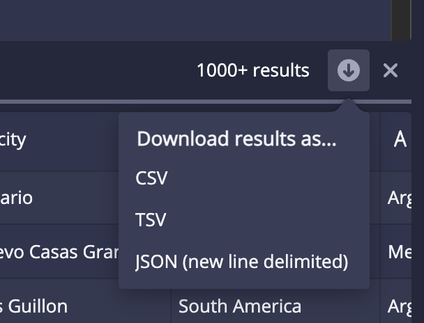

> The Multi-Stage Query Engine is a preview feature available starting in Imply 2022.06. Preview features enable early adopters to benefit from new functionality while providing ongoing feedback to help shape and evolve the feature. All functionality documented on this page is subject to change or removal in future releases. Preview features are provided "as is" and are not subject to Imply SLAs.

## Release notes

### 2022.06

#### Changes and improvements

- Property names have changed. Previously, properties used the `talaria` prefix. They now either use `msq` or `multiStageQuery` depending on the context. Note that the extension is still named `imply-talaria`.
- You no longer need a license that has an explicit entitlement for MSQE.
- MSQE now supports S3 as a storage medium when using mesh shuffles. For more information, see [Durable storage for mesh shuffles](./msqe-advanced-configs.md#durable-storage-for-mesh-shuffle).
- Reports for MSQE queries now include warning sections that provide information about the type of warning and number of occurrences. 
- You can now use REPLACE in MSQE queries. For more information, see [REPLACE](./msqe-sql-syntax.md#replace).
- The default mode for MSQE is now `strict`. This means that a query fails if there is a single malformed record. You can change this behavior using the context variable [`msqMode`](./msqe-api.md#context-variables) (previously `talariaMode`).
- The behavior of `msqNumTasks` (previously `talariaNumTasks`) has changed. It now accurately reflects the total number of slots required, including the controller. Previously, the controller was not accounted for. 
- The EXTERN operator now requires READ access to the resource type EXTERNAL that is named EXTERNAL. This new permission must be added manually to API users who issue queries that access external data. In Imply Enterprise Hybrid and in Imply Enterprise, this permission is added automatically to users with the ManageDatasets permission. For Imply Enterprise, you must update Imply Manager to 2022.06 prior to updating your Imply version to 2022.06.
- Queries that carry large amounts of data through multiple stages are sped up significantly due to performance enhancements in sorting and shuffling.
- Queries that use GROUP BY followed by ORDER BY, PARTITIONED BY, or CLUSTERED BY execute with one less stage, improving performance.
- Strings are no longer permitted to contain null bytes. Strings containing null bytes will result in an InvalidNullByte error.
- INSERT or REPLACE queries with null values for `__time` now exit with an InsertTimeNull error.
- INSERT or REPLACE queries that are aborted due to lock preemption now exit with an InsertLockPreempted error. Previously, they would exit with an UnknownError.
- MSQE generated segments can now be used with Pivot datacubes and support auto-compaction if the query conforms to the conditions defined in [GROUP BY](./msqe-sql-syntax.md#group-by).
- You an now download the results of a query as a CSV, TSV, JSON file. Click the download icon in the Query view after you run a query: .

#### Fixes
 
 - Fixed an issue where the controller task would stall indefinitely when its worker tasks could not all start up. Now, the controller task exits with a TaskStartTimeout after ten minutes.
 - Fixed an issue where the controller task would exit with an UnknownError when canceled. Now, the controller task correctly exits with a Canceled error.
 - Fixed an issue where error message when `groupByEnableMultiValueUnnesting: false` is set in the context of a query that uses GROUP BY referred to  the parameter `executingNestedQuery`. It now uses the correct parameter `groupByEnableMultiValueUnnesting`.
 - Fixed an issue where the true error would sometimes be shadowed by a WorkerFailed error. (20466)
 - Fixed an issue where tasks would not retry certain retryable Overlord API errors. Now, these errors are retried, improving reliability.

### 2022.05

- You no longer need to load the `imply-sql-async` extension to use the Multi-Stage Query Engine. You only need to load the `imply-talaria` extension.
- The API endpoints have changed. Earlier versions of the Multi-Stage Query Engine used the `/druid/v2/sql/async/` endpoint. The engine now uses different endpoints based on what you're trying to do: `/druid/v2/sql/task` and `/druid/indexer/v1/task/`. For more information, see [API](./msqe-api.md).
- You no longer need to set a context parameter for `talaria` when making API calls. API calls to the `task` endpoint use the Multi-Stage Query Engine automatically.
- Fixed an issue that caused an `IndexOutOfBoundsException` error to occur, which led to some ingestion jobs failing.

### 2022.04

- Stage outputs are now removed from local disk when no longer needed. This reduces the total
  amount of local disk space required by jobs with more than two stages. (15030)
- It is now possible to control segment sort order independently of CLUSTERED BY, using the
  new [`talariaSegmentSortOrder`](./msqe-api.md#context-variables) context parameter. (18320)
- There is now a guardrail on the maximum number of input files. Exceeded this limit leads to
  a [TooManyInputFiles](./msqe-api.md#error-codes)) error. (15020)
- Queries now report the error code [WorkerRpcFailed](./msqe-api.md#error-codes)) when controller-to-worker or
  worker-to-worker communication fails. Previously, this would be reported as an
  UnknownError. (18971)
- Fixed an issue where queries with large numbers of partitions could run out of memory. (19162)
- Fixed an issue where worker errors were sometimes hidden by controller errors that cascaded
  from those worker failures. Now, the original worker error is preferred. (18971)
- Fixed an issue where worker errors were incompletely logged in worker task logs. (18964)
- Fixed an issue where workers could sometimes fail soon after startup with a
  `NoSuchElementException`. (19048)
- Fixed an issue where worker tasks sometimes continued running after controller
  failures. (18052)

### 2022.03

- The web console now includes counters for external input rows and files, Druid table input rows
  and segments, and sort progress. As part of this change, the query detail response format has
  changed. Clients performing programmatic access will need to be updated. (15048, 15208, 18070)
- Added the ability to avoid unnesting [multi-value string dimensions](./msqe-sql-syntax.md#multi-value-dimensions)
  during GROUP BY. This is useful for performing ingestion with rollup. (15031, 16875, 16887)
- EXPLAIN PLAN FOR now works properly on INSERT queries. (17321)
- External input files are now read in parallel when running in Indexers. (17933)
- Improved accuracy of partition-determination. Segments generated by INSERT are now more regularly
  sized. (17867)
- [CannotParseExternalData](./msqe-api.md#error-codes)) error reports now include input file path and line number
  information. (16016)
- There is now an upper limit on the number of workers, partially determined by available memory.
  Exceeding this limit leads to a [TooManyWorkers](./msqe-api.md#error-codes)) error. (15021)
- There is now a guardrail on the maximum size of data involved in a broadcast join. Queries that
  exceed the limit will report a [BroadcastTablesTooLarge](./msqe-api.md#error-codes)) error code. (15024)
- When a worker fails abruptly, the controller now reports a [WorkerTaskFailed](./msqe-api.md#error-codes)) error
  code instead of UnknownError. (15024)
- Controllers will no longer give up on workers before the Overlord does. Previously, the controller
  would fail with the message "Connection refused" if workers took longer than 30 seconds to start
  up. (17602)
- Fixed an issue where INSERT queries that generate large numbers of time chunks may fail with a
  message containing "SketchesArgumentException: K must be >= 2 and <= 32768 and a power of 2". This
  happened when the number of generated time chunks was close to the [TooManyBuckets](./msqe-advanced-configs.md#limits)
  limit. (14764)
- Fixed an issue where queries with certain input sources would report an error with the message
  "Too many workers" when there were more files than workers. (18022)
- Fixed an issue where SELECT queries with LIMIT would sometimes return more rows than intended.
  (17394)
- Fixed an issue where workers could intermittently fail with an UnknownError with the message "Invalid midstream marker". (17602)
- Fixed an issue where workers could run out of memory when connecting to large numbers of other
  workers. (16153)
- Fixed an issue where workers could run out of memory during GROUP BY of large external input
  files. (17781)
- Fixed an issue where workers could retry reading the same external input file repeatedly and never
  succeed. (17936, 18009)

### 2022.02

- INSERT uses PARTITIONED BY and CLUSTERED BY instead of talariaSegmentGranularity and ORDER BY. (15045)
- INSERT validates the datasource name at planning time instead of execution time. (15038)
- SELECT queries support OFFSET. (15000)
- The "Connect external data" feature in the Query view of the web console correctly supports Parquet files.
  Previously, this feature would report a "ParseException: Incorrect Regex" error on Parquet files. (16197)
- The Query detail API includes startTime and durationMs for the whole query. (15046)

### 2022.01

- Multi-stage queries can now be issued using the async query API provided by the
  [`imply-sql-async`](https://docs.imply.io/latest/druid/querying/sql-async-download-api/#submit-a-query)
  extension. (15014)
- New `talariaFinalizeAggregations` parameter may be set to false to cause queries to emit nonfinalized
  aggregation results. (15010)
- INSERT queries obtain minimally-sized locks rather than locking the entire target datasource. (15003)
- The Query view of the web console now has tabs and an engine selector that allows issuing multi-stage queries.
  The dedicated "Talaria" view has been removed.
- The web console includes an ingestion spec conversion tool. It performs a best-effort conversion of a native batch
  ingestion spec into a SQL query. It does not guarantee perfect fidelity, so we recommend that you
  review the generated SQL query before running it.
- INSERT queries with LIMIT and `talariaSegmentGranularity` set to "all" now execute properly and write a single
  segment to the target datasource. Previously, these queries would fail. (15051)
- INSERT queries using `sqlReplaceTimeChunks` now always produce "range" shard specs when appropriate. Previously,
  "numbered" shard specs would sometimes be produced instead of "range" shard specs as documented. (14768)

### 2021.12

- Initial release.

## Known issues

### General query execution

- MSQE does not have fault tolerance. If any task fails, the entire query fails. 

- In case of a worker crash, stage outputs on S3 are not deleted automatically. You may need to delete
  the file using an external process or create an S3 lifecycle policy to remove the objects
  under `druid.talaria.intermediate.storage.prefix`. A good start would be to delete the objects after 3 days if they are
  not automatically deleted. (21917)

- On cancelation or failure due to exception, the controller shuts down its worker tasks as part of
  an orderly exit. However, worker tasks may outlive the controller in situations where the
  controller vanishes without a chance to run its shutdown routines. This can happen due to
  conditions like JVM crashes, OS crashes, or sudden hardware failure. (18052)

- Only one local filesystem per server is used for stage output data during multi-stage query
  execution. If your servers have multiple local filesystems, this causes queries to exhaust
  available disk space earlier than expected. As a workaround, you can use [durable storage for shuffle meshes](./msqe-advanced-configs.md#durable-storage-for-mesh-shuffle). (16181)

- When `msqMaxNumTasks` (formerly `msqNumTasks`, formerly `talariaNumTasks`) is higher than the total
  capacity of the cluster, more tasks may be launched than can run at once. This leads to a
  [TaskStartTimeout](./msqe-api.md#error-codes) error code, as there is never enough capacity to run the query.
  To avoid this, set `msqMaxNumTasks` to a number of tasks that can run simultaneously on your cluster. (23242)

- When `msqTaskAssignment` is set to `auto`, the system generates one task per input file for certain splittable
  input sources where file sizes are not known ahead of time. This includes the `http` input source, where the system
  generates one task per URI. (23163)

### Memory usage

- INSERT queries can consume excessive memory when using complex types due to inaccurate footprint
  estimation. This can appear as an OutOfMemoryError during the SegmentGenerator stage when using
  sketches. If you run into this issue, try manually lowering the value of the
  [`talariaRowsInMemory`](./msqe-api.md#context-variables) parameter. (17946)

- INSERT queries can consume excessive memory on Indexers due to a too-high default value of
  `druid.processing.numThreads`. This can appear as an OutOfMemoryError during the SegmentGenerator
  stage. If you run into this issue, try manually setting this parameter to one less than the number
  of processors on the server. (18047)

- EXTERN loads an entire row group into memory at once when reading from Parquet files. Row groups
  can be up to 1 GB in size, which can lead to excessive heap usage when reading many files in
  parallel. This can appear as an OutOfMemoryError during stages that read Parquet input files. If
  you run into this issue, try using a smaller number of worker tasks or you can increase the heap
  size of your Indexers or of your Middle Manager-launched indexing tasks. (17932)

### SELECT queries

- SELECT query results do not include realtime data until it has been published. (18092)

<!-- 
- SELECT query results are funneled through the controller task
  so they can be written to the query report.
  This is a bottleneck for queries with large resultsets. In the future,
  we will provide a mechanism for writing query results to multiple
  files in parallel. (14728)
-->
<!--
- SELECT query results are materialized in memory on the Broker when
  using the query results API. Large result sets
  can cause the Broker to run out of memory. (15963)
-->

- TIMESTAMP types are formatted as numbers rather than ISO8601 timestamp
  strings, which differs from Druid's standard result format. (14995)

- BOOLEAN types are formatted as numbers like `1` and `0` rather
  than `true` or `false`, which differs from Druid's standard result
  format. (14995)

- TopN is not implemented. The context parameter
  `useApproximateTopN` is ignored and always treated as if it
  were `false`. Therefore, topN-shaped queries will
  always run using the groupBy engine. There is no loss of
  functionality, but there may be a performance impact, since
  these queries will run using an exact algorithm instead of an
  approximate one. (14998)

- GROUPING SETS is not implemented. Queries that use GROUPING SETS
  will fail. (14999)

- The numeric flavors of the EARLIEST and LATEST aggregators do not work
  properly. Attempting to use the numeric flavors of these aggregators will
  lead to an error like
  `java.lang.ClassCastException: class java.lang.Double cannot be cast to class org.apache.druid.collections.SerializablePair`.
  The string flavors, however, do work properly. (15040)

- When querying system tables in `INFORMATION_SCHEMA` or `sys`, the
  SQL API ignores the `talaria` parameter, and treats it as if it
  were false. These queries always run with the core Druid
  query engine. (15002)

###  INSERT queries

- The [schemaless dimensions](https://docs.imply.io/latest/druid/ingestion/ingestion-spec.html#inclusions-and-exclusions)
feature is not available. All columns and their types must be specified explicitly. (15004)

- [Segment metadata queries](https://docs.imply.io/latest/druid/querying/segmentmetadataquery.html)
  on datasources ingested with the Multi-Stage Query Engine will return values for`timestampSpec` that are not usable
  for introspection.
  (15007)
- Figuring out `rollup`, `query-granularity`, and `aggregatorFactories` is on a best effort basis. In
  particular, Pivot will not be able to automatically create data cubes that properly reflect the
  rollup configurations if the insert query does not meet the conditions defined in [Rollup](./msqe-sql-syntax.md#group-by). Proper data cubes
  can still be created manually. (20879)

- When INSERT with GROUP BY does the match the criteria mentioned in [GROUP BY](./msqe-sql-syntax.md#group-by),  the multi-stage engine generates segments that Druid's compaction
  functionality is not able to further roll up. This applies to autocompaction as well as manually
  issued `compact` tasks. Individual queries executed with the multi-stage engine always guarantee
  perfect rollup for their output, so this only matters if you are performing a sequence of INSERT
  queries that each append data to the same time chunk. If necessary, you can compact such data
  using another SQL query instead of a `compact` task.   (17945)

- When using INSERT with GROUP BY, not all aggregation functions are implemented. See the
  [GROUP BY](./msqe-sql-syntax.md#group-by) section for a list of aggregation functions that are currently available in
  conjuction with INSERT. Note that all aggregations are supported for SELECT queries. (15010)

- When using INSERT with GROUP BY, splitting of large partitions is not currently
  implemented. If a single partition key appears in a
  very large number of rows, an oversized segment will be created.
  You can mitigate this by adding additional columns to your
  partition key. Note that partition splitting _does_ work properly
  when performing INSERT without GROUP BY. (15015)

- INSERT with column lists, like
  `INSERT INTO tbl (a, b, c) SELECT ...`, is not implemented. (15009)

### EXTERN queries

- EXTERN does not accept `druid` or `sql` input sources. (15016, 15018)

### Missing guardrails

- Maximum number of input files. No guardrail today means the controller can potentially run out of
  memory tracking them all. (15020)

- Maximum amount of local disk space to use for temporary data. No guardrail today means worker
  tasks may exhaust all available disk space. In this case, you will receive an
  [UnknownError](./msqe-api.md#error-codes)) with a message including "No space left on device". (15022)

