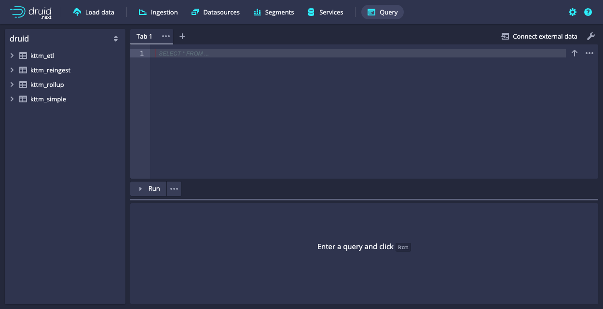
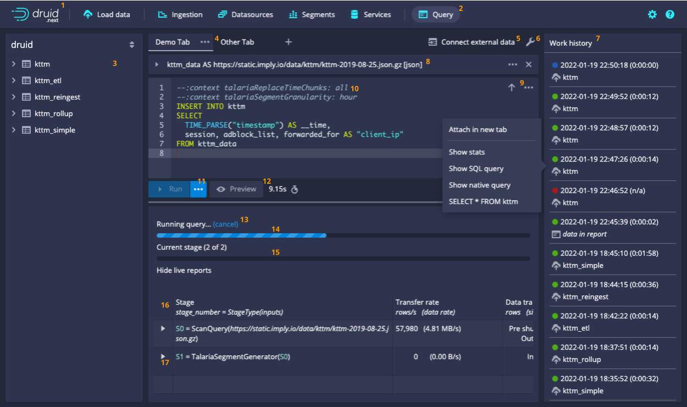

> Talaria is an alpha feature. All functionality documented on this page is
> subject to change or removal at any time. Alpha features are provided
> "as is" and are not subject to Imply SLAs.

Talaria is a query engine for Druid that supports larger, heavier-weight
queries, supports querying external data, and also supports ingestion
via SQL **INSERT**. It is named after Mercury's winged sandals, representing
shuffle of data between servers.

The Talaria engine hooks into the existing data processing routines
from Druid's standard query engine, so it has all the same query
capabilities and data server performance. But on top of that, it
adds a system that splits queries into stages and automatically
exchanges data between stages. Each stage is parallelized to run
across many data servers at once. There isn't any need for tuning
beyond selecting a concurrency level. This means that Talaria excels
at executing queries that are bottlenecked at the Broker in Druid's
standard query engine.

With Talaria, Druid can:

- Execute heavy-weight queries that return large numbers of rows and may
  run for a long time.
- Execute queries that need to exchange large amounts of data between
  servers, like exact count distinct of high-cardinality fields.
- Read external data at query time using the [`EXTERN`](#extern) function.
- Execute batch ingestion jobs as SQL queries using the [`INSERT`](#insert) keyword.
- Transform and rewrite existing Druid data using SQL queries.

## Setup

To try out the Talaria engine in Imply Cloud, launch a cluster with the following settings.

**Imply version**

2022.01 or later.

Note: Talaria is only available for STS versions of Imply at this time. It is not available in 2022.01 LTS.

**Custom extensions**

Add two entries:

1. Name `imply-talaria`, and "S3 path or url" blank.
2. Name `imply-sql-async`, and "S3 path or url" blank.

**Feature flags**

These feature flags are not required, but are recommended for the best
experience.

- *Use Indexers instead of Middle Managers.* We recommended enabling this option if you are creating a cluster primarily
for trying out Talaria-based queries. Indexers have a lower task launching overhead than Middle Managers, and are able
to provide a larger shared thread pool, which improves the speed of Talaria-based queries. However, if you are mixing
Talaria-based queries with classic batch or streaming ingestion, we recommend disabling this option to ensure minimal
disruption to non-Talaria-based workloads.
- *HTTP-based task management.* This is recommended in all cases.

**Common**

In the Common property overrides, add an Imply license string that includes
the `talaria` feature, and configure the `imply-sql-async` extension.

```
imply.license=<license string>

# Configure imply-sql-async extension.
# Note: this setup only works for Talaria; if you need regular async queries you must use storage type "s3".
druid.query.async.storage.type=local
druid.query.async.storage.local.directory=/mnt/tmp/async-query
```

**Coordinator**

```bash
druid.coordinator.balancer.strategy=cost
```

**Indexer** or **Middle Manager**

```bash
druid.server.http.numThreads=2000
druid.global.http.numConnections=1000

# Required for Java 11
jvm.config.dsmmap=--add-exports=java.base/jdk.internal.ref=ALL-UNNAMED
druid.indexer.runner.javaOptsArray=["--add-exports=java.base/jdk.internal.ref=ALL-UNNAMED"]
```

**Broker**

```bash
druid.sql.executor.type=imply
```

## Quickstart

Before running through this quickstart, run through [Setup](#setup) to
get a cluster started. Once you've done that, the best way to start running
queries with Talaria is with the Talaria-enhanced query view in the Druid
web console.

To get started with this view:

1. Select **Manage data** in Imply Cloud to open the Druid console.
2. Select **Query** from the top menu.
3. Click the dots "..." next to *Run* and select **talaria** from the **Query engine** menu. If you don't see this
menu, try alt- or option-clicking the Druid logo first.

Notice that the SQL editing field appears in a tab. If you like, you can
open multiple tabs to run queries simultaneously.



Run the following query to try Talaria with external sample data.

```sql
SELECT *
FROM TABLE(
  EXTERN(
    '{"type": "http", "uris": ["https://static.imply.io/gianm/wikipedia-2016-06-27-sampled.json"]}',
    '{"type": "json"}',
    '[{"name": "added", "type": "long"}, {"name": "channel", "type": "string"}, {"name": "cityName", "type": "string"}, {"name": "comment", "type": "string"}, {"name": "commentLength", "type": "long"}, {"name": "countryIsoCode", "type": "string"}, {"name": "countryName", "type": "string"}, {"name": "deleted", "type": "long"}, {"name": "delta", "type": "long"}, {"name": "deltaBucket", "type": "string"}, {"name": "diffUrl", "type": "string"}, {"name": "flags", "type": "string"}, {"name": "isAnonymous", "type": "string"}, {"name": "isMinor", "type": "string"}, {"name": "isNew", "type": "string"}, {"name": "isRobot", "type": "string"}, {"name": "isUnpatrolled", "type": "string"}, {"name": "metroCode", "type": "string"}, {"name": "namespace", "type": "string"}, {"name": "page", "type": "string"}, {"name": "regionIsoCode", "type": "string"}, {"name": "regionName", "type": "string"}, {"name": "timestamp", "type": "string"}, {"name": "user", "type": "string"}]'
  )
)
LIMIT 100
```

Talaria enhances Druid so we can now query external data using the
[`EXTERN`](#extern) function.

To ingest the query results into a table, run the following query.

```sql
--:context talariaSegmentGranularity: day

INSERT INTO wikipedia
SELECT
  TIME_PARSE("timestamp") AS __time,
  *
FROM TABLE(
  EXTERN(
    '{"type": "http", "uris": ["https://static.imply.io/gianm/wikipedia-2016-06-27-sampled.json"]}',
    '{"type": "json"}',
    '[{"name": "added", "type": "long"}, {"name": "channel", "type": "string"}, {"name": "cityName", "type": "string"}, {"name": "comment", "type": "string"}, {"name": "commentLength", "type": "long"}, {"name": "countryIsoCode", "type": "string"}, {"name": "countryName", "type": "string"}, {"name": "deleted", "type": "long"}, {"name": "delta", "type": "long"}, {"name": "deltaBucket", "type": "string"}, {"name": "diffUrl", "type": "string"}, {"name": "flags", "type": "string"}, {"name": "isAnonymous", "type": "string"}, {"name": "isMinor", "type": "string"}, {"name": "isNew", "type": "string"}, {"name": "isRobot", "type": "string"}, {"name": "isUnpatrolled", "type": "string"}, {"name": "metroCode", "type": "string"}, {"name": "namespace", "type": "string"}, {"name": "page", "type": "string"}, {"name": "regionIsoCode", "type": "string"}, {"name": "regionName", "type": "string"}, {"name": "timestamp", "type": "string"}, {"name": "user", "type": "string"}]'
  )
)
```

The context comment (line 1) passes an ingestion configuration parameter
along with the query, specifying day-based segment granularity. The
data is inserted into the `wikipedia` table.

> Context comments are available only in the web console. When using
> the API, context comments will be ignored, and
> [context parameters](https://druid.apache.org/docs/latest/querying/query-context.html)
> must be provided separately from the query string.

The data is now queryable. Run the following query to analyze the data
in the ingested table, producing a list of top channels.

```sql
SELECT
  channel,
  COUNT(*)
FROM wikipedia
GROUP BY channel
ORDER BY COUNT(*) DESC
```

The same query would also work on the external data directly.

```sql
SELECT
  channel,
  COUNT(*)
FROM TABLE(
  EXTERN(
    '{"type": "http", "uris": ["https://static.imply.io/gianm/wikipedia-2016-06-27-sampled.json"]}',
    '{"type": "json"}',
    '[{"name": "added", "type": "long"}, {"name": "channel", "type": "string"}, {"name": "cityName", "type": "string"}, {"name": "comment", "type": "string"}, {"name": "commentLength", "type": "long"}, {"name": "countryIsoCode", "type": "string"}, {"name": "countryName", "type": "string"}, {"name": "deleted", "type": "long"}, {"name": "delta", "type": "long"}, {"name": "deltaBucket", "type": "string"}, {"name": "diffUrl", "type": "string"}, {"name": "flags", "type": "string"}, {"name": "isAnonymous", "type": "string"}, {"name": "isMinor", "type": "string"}, {"name": "isNew", "type": "string"}, {"name": "isRobot", "type": "string"}, {"name": "isUnpatrolled", "type": "string"}, {"name": "metroCode", "type": "string"}, {"name": "namespace", "type": "string"}, {"name": "page", "type": "string"}, {"name": "regionIsoCode", "type": "string"}, {"name": "regionName", "type": "string"}, {"name": "timestamp", "type": "string"}, {"name": "user", "type": "string"}]'
  )
)
GROUP BY channel
ORDER BY COUNT(*) DESC
```

For more examples, see the [Example queries](#example-queries) section.

## Key concepts

The Talaria engine extends Druid's query stack to handle multi-stage,
asynchronous queries that can exchange data between stages.

At this time, queries execute using indexing service tasks, even for
regular SELECT (non-INSERT) queries. At least two task slots per query
are occupied while a query is running. This behavior is subject to
change in future releases.

Key concepts for Talaria-based query execution:

- **Controller**: an indexing service task of type `talaria0` that manages
  the execution of a query. There is one controller task per query.

- **Worker**: indexing service tasks of type `talaria1` that execute a
  query. There may be more than one worker task per query. Internally,
  the tasks process items in parallel using their processing pools.
  (i.e., up to `druid.processing.numThreads` of execution parallelism
  within a worker task).

- **Stage**: a stage of query execution that is parallelized across
  worker tasks. Workers exchange data with each other between stages.

- **Partition**: a slice of data output by worker tasks. In INSERT
  queries, the partitions of the final stage become Druid segments.

When you run a query with Talaria, the following happens:

1.  The **Broker** plans your SQL query into a native query, as usual.

2.  The Broker wraps the native query into a task of type `talaria0`
    and submits it to the indexing service. The Broker returns the task
    ID to you and exits.

3.  The **controller task** launches a wave of **worker tasks** based on
    the `talariaNumTasks` query context parameter.

4.  The worker tasks execute the query.

5.  If the query is a SELECT query, the worker tasks send the results
    back to the controller task, which writes them into its task report.
    If the query is an INSERT query, the worker tasks generate and
    publish new Druid segments to the provided datasource.

6.  For Talaria-based queries, async query APIs such as [status](#get-query-status),
    [results](#get-query-results), and [details](#get-query-details) work by
    fetching task status and task reports under the hood.

## Query API

### Submit a query

> Talaria-based query APIs are in a work-in-progress state for the alpha. They may change in future releases.
> We recommend using the [web console](#web-console) if you do not need a programmatic interface.

#### Request

Submit queries using the [`POST /druid/v2/sql/async/`](/latest/druid/querying/imply-sql-async-api/#submit-a-query) API provided by
the `imply-sql-async` extension, with `talaria: true` set as a
[context parameter](https://druid.apache.org/docs/latest/querying/sql.html#connection-context).

Currently, Talaria-based queries ignore the provided values of `resultFormat`, `header`, `typesHeader`, and
`sqlTypesHeader`. They always behave as if `resultFormat` is "array", `header` is true, `typesHeader` is true, and
`sqlTypesHeader` is true.

See below for an example request and response. For more details, refer to the
[`imply-sql-async` documentation](/latest/druid/querying/imply-sql-async-api/#submit-a-query).

**HTTP**

```
POST /druid/v2/sql/async/
```

```json
{
  "query" : "SELECT 1 + 1",
  "context" : {
    "talaria" : true
  }
}
```

**curl**

```
curl -XPOST -H'Content-Type: application/json' \
  https://IMPLY-ENDPOINT/druid/v2/sql/async/ \
  -u 'user:password' \
  --data-binary '{"query":"SELECT 1 + 1","context":{"talaria":true}}'
```

**Query syntax**

The `query` can be any
[Druid SQL](https://druid.apache.org/docs/latest/querying/sql.html)
query, subject to the limitations mentioned in the [Known issues](#known-issues)
section. In addition to standard Druid SQL syntax, queries that run with Talaria
can use two additional features:

- [INSERT INTO ... SELECT](#insert) to insert query results into Druid datasources.
- [EXTERN](#extern) to query external data from S3, GCS, HDFS, and so on.

**Context parameters**

The Talaria engine accepts additional Druid SQL
[context parameters](https://druid.apache.org/docs/latest/querying/sql.html#connection-context).

> Context comments like `--:context talariaSegmentGranularity: day`
> are available only in the web console. When using the API, context comments
> will be ignored, and context parameters must be provided in the `context`
> section of the JSON object.

|Parameter|Description|Default value|
|----|-----------|----|
| talaria| True to execute using Talaria, false to execute using Druid's native query engine| false|
| talariaNumTasks| (SELECT or INSERT)<br /><br />Talaria queries execute using the indexing service, i.e. using the Overlord + MiddleManager / Indexer. This property specifies the number of worker tasks to launch.<br /><br />The total number of tasks launched will be `talariaNumTasks` + 1, because there will also be a controller task.<br /><br />All tasks must be able to launch simultaneously. If they cannot, the query will not be able to execute. Therefore, it is important to set this parameter at most one lower than the total number of task slots.| 1 |
| talariaFinalizeAggregations | (SELECT or INSERT)<br /><br />Whether Druid will finalize the results of complex aggregations that directly appear in query results.<br /><br />If true, Druid returns the aggregation's intermediate type rather than finalized type. This parameter is useful during ingestion, where it enables storing sketches directly in Druid tables. | true |
| talariaSegmentGranularity | (INSERT only)<br /><br />Segment granularity to use when generating segments.<br /><br />Your query must have an ORDER BY that matches the time granularity. See the "INSERT" section above for examples.<br /><br />At some point this will be replaced by a "PARTITION BY" keyword.| all|
| talariaReplaceTimeChunks | (INSERT only)<br /><br />Whether Druid will replace existing data in certain time chunks during ingestion. This can either be the word "all" or a comma-separated list of intervals in ISO8601 format, like `2000-01-01/P1D,2001-02-01/P1D`. The provided intervals must be aligned with the granularity given by `talariaSegmentGranularity`.<br /><br />At the end of a successful query, any data previously existing in the provided intervals will be replaced by data from the query. If the query generates no data for a particular time chunk in the list, then that time chunk will become empty. If set to `all`, the results of the query will replace all existing data.<br /><br />All ingested data must fall within the provided time chunks. If any ingested data falls outside the provided time chunks, the query will fail with an [InsertTimeOutOfBounds](#errors) error.<br /><br />When `talariaReplaceTimeChunks` is set, all ORDER BY columns are singly-valued strings, and there is no LIMIT or OFFSET, then Druid will generate "range" shard specs. Otherwise, Druid will generate "numbered" shard specs. | null<br /><br />(i.e., append to existing data, rather than replace)|
| talariaRowsPerSegment| (INSERT only)<br /><br />Number of rows per segment to target for INSERT queries. The actual number of rows per segment may be somewhat higher or lower than this number.<br /><br />In most cases, you should stick to the default.| 3000000 |

#### Response

```json
{
  "asyncResultId": "talaria-sql-58b05e02-8f09-4a7e-bccd-ea2cc107d0eb",
  "state": "RUNNING",
  "resultFormat": "array",
  "engine": "Talaria-Indexer"
}
```

**Response fields**

|Field|Description|
|-----|-----------|
|asyncResultId|Controller task ID.<br /><br />Druid's standard [task APIs](https://druid.apache.org/docs/latest/operations/api-reference.html#overlord) can be used to interact with this controller task.|
|state|Initial state for the query, which is "RUNNING".|
|resultFormat|Always "array", regardless of what was specified in your original query, because Talaria-based queries currently only support the "array" result format.|
|engine|String "Talaria-Indexer" if this query was run with Talaria.|

### Get query status

> Talaria-based query APIs are in a work-in-progress state for the alpha. They may change in future releases.
> We recommend using the [web console](#web-console) if you do not need a programmatic interface.

Poll the [`GET /druid/v2/sql/async/{asyncResultId}/status`](/latest/druid/querying/imply-sql-async-api/#get-query-status) API
provided by the `imply-sql-async` extension.

See below for an example request and response. For more details, refer to the
[`imply-sql-async` documentation](/latest/druid/querying/imply-sql-async-api/#get-query-status).

#### Request

```
GET /druid/v2/sql/async/{asyncResultId}/status
```

**curl**

```
curl -u 'user:password' \
  https://IMPLY-ENDPOINT/druid/v2/sql/async/ASYNC-RESULT-ID/status
```

#### Response

```json
{
  "asyncResultId": "talaria-sql-bc9aa8b8-05fc-4223-ad07-3edfb427c709",
  "state": "COMPLETE",
  "resultFormat": "array",
  "engine": "Talaria-Indexer"
}
```

### Get query results

> Talaria-based query APIs are in a work-in-progress state for the alpha. They may change in future releases.
> We recommend using the [web console](#web-console) if you do not need a programmatic interface.

If the query succeeds, and is a `SELECT` query, obtain the results using the
[`GET /druid/v2/sql/async/{asyncResultId}/results`](/latest/druid/querying/imply-sql-async-api/#get-query-results) API
provided by the `imply-sql-async` extension.

See below for an example request and response. For more details, refer to the
[`imply-sql-async` documentation](/latest/druid/querying/imply-sql-async-api/#get-query-results).

#### Request

```
GET /druid/v2/sql/async/{asyncResultId}/results
```

**curl**

```
curl -u 'user:password' \
  https://IMPLY-ENDPOINT/druid/v2/sql/async/ASYNC-RESULT-ID/results
```

#### Response

```json
[["EXPR$0"],["LONG"],["INTEGER"],[2]]
```

Currently, Talaria-based queries ignore the provided values of `resultFormat`, `header`, `typesHeader`, and
`sqlTypesHeader`. They always behave as if `resultFormat` is "array", `header` is true, `typesHeader` is true, and
`sqlTypesHeader` is true.

### Cancel a query

> Talaria-based query APIs are in a work-in-progress state for the alpha. They may change in future releases.
> We recommend using the [web console](#web-console) if you do not need a programmatic interface.

Cancel a query using the
[`DELETE /druid/v2/sql/async/{asyncResultId}`](/latest/druid/querying/imply-sql-async-api/#cancel-a-query) API
provided by the `imply-sql-async` extension.

When a Talaria-based query is canceled, the query results and metadata are not removed. This differs
from Broker-based async queries, where query results and metadata are removed when a query is canceled.

See below for an example request. For more details, refer to the
[`imply-sql-async` documentation](/latest/druid/querying/imply-sql-async-api/#cancel-a-query).

### Get query details

> Talaria-based query APIs are in a work-in-progress state for the alpha. They may change in future releases.
> We recommend using the [web console](#web-console) if you do not need a programmatic interface.

Detailed information about query execution is available for Talaria-based
queries, including:

- Status (running, successful exit, failure).
- Stages of query execution, along with their current progress.
- Any errors encountered.

Query details are physically stored in the task report for the controller
task.

The details API may return `500 Server Error` or `404 Not Found` when
tasks are in the process of starting up or shutting down. If you encounter
this error for a task that you expect should have details available, either
try again later or check the [Status API](#get-query-status) to see if the
task has failed before it was able to write its report.

It is possible for the query status in the details API to differ from the
query status in the [Status API](#get-query-status). This can happen because
the details are sourced from the task report, which is written by the
controller task itself, but the final status is sourced from Druid's task
execution framework. For example, it is possible for the details to say
`SUCCESS`, but the actual task to say `FAILED`, if there is a failure in
cleanup after the report has been written.

#### Request

**HTTP**

```
GET /druid/v2/sql/async/{asyncResultId}
```

**curl**

```
curl -u 'user:password' \
  https://IMPLY-ENDPOINT/druid/v2/sql/async/ASYNC-RESULT-ID
```

#### Response

**Report for successful query**

```json
{
  "talariaStatus": {
    "taskId": "talaria-sql-f5f6d28c-654c-4c9e-ac38-af67f3407352",
    "payload": {"status": "SUCCESS"}
  },
  "talariaResults": {
    "taskId": "talaria-sql-f5f6d28c-654c-4c9e-ac38-af67f3407352",
    "payload": {
      "signature": [{"name": "EXPR$0", "type": "LONG"}],
      "sqlTypeNames": ["INTEGER"]
    }
  },
  "talariaStages": {
    "taskId": "talaria-sql-f5f6d28c-654c-4c9e-ac38-af67f3407352",
    "payload": {
      "stages": [
        {
          "stageNumber": 0,
          "inputStages": [],
          "stageType": "ScanQueryFrameProcessorFactory",
          "phase": "RESULTS_COMPLETE",
          "workerCount": 1,
          "partitionCount": 1,
          "startTime": "2021-12-15T20:49:12.194Z",
          "duration": 16523,
          "query": {
            "queryType": "scan",
            "dataSource": {
              "type": "inline",
              "columnNames": ["EXPR$0"],
              "columnTypes": ["LONG"],
              "rows": [[2]]
            },
            "intervals": "-146136543-09-08T08:23:32.096Z/146140482-04-24T15:36:27.903Z",
            "resultFormat": "compactedList",
            "limit": 1001,
            "columns": ["EXPR$0"],
            "context": {
              "sqlOuterLimit": 1001,
              "sqlQueryId": "f5f6d28c-654c-4c9e-ac38-af67f3407352",
              "talaria": true,
              "talariaSignature": "[{\"name\":\"EXPR$0\",\"type\":\"LONG\"}]"
            },
            "granularity": "all"
          }
        },
        {
          "stageNumber": 1,
          "inputStages": [0],
          "stageType": "LimitFrameProcessorFactory",
          "phase": "RESULTS_COMPLETE",
          "workerCount": 1,
          "partitionCount": 1,
          "startTime": "2021-12-15T20:49:28.674Z",
          "duration": 282
        }
      ]
    }
  },
  "talariaTask": {
    "task": "talaria-sql-f5f6d28c-654c-4c9e-ac38-af67f3407352",
    "payload": { ... }
  }
}
```

**Report for failed query**

```json
{
  "talariaStatus": {
    "taskId": "talaria-sql-example-e401bdb3-3810-47ea-a103-318923b4bb76",
    "payload": {
      "status": "FAILED",
      "errorReport": {
        "taskId": "talaria1_example_ekofpcgc_2021-12-15T22:26:46.310Z",
        "host": "indexer01.druid.example.com:8100",
        "stageNumber": 0,
        "error": {
          "errorCode": "TooManyBuckets",
          "maxBuckets": 10000,
          "errorMessage": "Too many partition buckets (max = 10,000); try breaking your query up into smaller queries or using a wider segmentGranularity"
        },
        "exceptionStackTrace": "io.imply.druid.talaria.frame.cluster.statistics.TooManyBucketsException: Too many buckets; maximum is [10000]\n\tat io.imply.druid.talaria.frame.cluster.statistics.ClusterByStatisticsCollectorImpl.getOrCreateBucketHolder(ClusterByStatisticsCollectorImpl.java:324)\n"
      }
    }
  },
  "talariaStages": { ... },
  "talariaTask": {
    "task": "talaria-sql-f5f6d28c-654c-4c9e-ac38-af67f3407352",
    "payload": { ... }
  }
}
```

**Response fields**

|Field|Description|
|-----|-----------|
|talariaStatus|Query status container.|
|talariaStatus.taskId|Controller task ID.|
|talariaStatus.payload.status|RUNNING, SUCCESS, or FAILED.|
|talariaStatus.payload.errorReport.taskId|Task ID that reported the error. May be the controller task or a worker task.|
|talariaStatus.payload.errorReport.host|The hostname and port of the task that reported the error, if known.|
|talariaStatus.payload.errorReport.stageNumber|The stage number that reported the error, if it happened during execution of a specific stage.|
|talariaStatus.payload.errorReport.error|Error object. Contains `errorCode` at a minimum, and may contain other fields as described in the [error code table](#errors). Always present if there is an error.|
|talariaStatus.payload.errorReport.error.errorCode|One of the error codes from the [error code table](#errors). Always present if there is an error.|
|talariaStatus.payload.errorReport.error.errorMessage|User-friendly error message. Not always present, even if there is an error.|
|talariaStatus.payload.errorReport.exceptionStackTrace|Java stack trace in string form, if the error was due to a server-side exception.|
|talariaResults|Query result container. Only present for SELECT queries that have successfully completed.
|talariaResults.taskId|Controller task ID.|
|talariaResults.payload.signature|Row signature of query results. The `type` fields are [native Druid types](https://druid.apache.org/docs/latest/querying/sql.html#data-types).|
|talariaResults.payload.sqlTypeNames|SQL type names of query results. This is an array of the same length as talariaResults.payload.signature. The types are [SQL types](https://druid.apache.org/docs/latest/querying/sql.html#data-types) rather than native Druid types.|
|talariaStages|Query stage details container.|
|talariaStages.taskId|Controller task ID.|
|talariaStages.payload.stages|Array of query stages.|
|talariaStages.payload.stages[].stageNumber|Each stage has a number that differentiates it from other stages.|
|talariaStages.payload.stages[].inputStages|Array of input stage numbers.|
|talariaStages.payload.stages[].stageType|String that describes the logic of this stage. This is not necessarily unique across stages.|
|talariaStages.payload.stages[].phase|Either NEW, READING_INPUT, POST_READING, RESULTS_COMPLETE, or FAILED. Only present if the stage has started.|
|talariaStages.payload.stages[].workerCount|Number of parallel tasks that this stage is running on. Only present if the stage has started. May be less than the final number of worker tasks if the stage is not yet in phase RESULTS_COMPLETE.|
|talariaStages.payload.stages[].partitionCount|Number of output partitions generated by this stage. Only present if the stage has started and has computed its number of output partitions. May be less than the actual number of output partitions if the stage is not yet in phase RESULTS_COMPLETE.|
|talariaStages.payload.stages[].startTime|Start time of this stage. Only present if the stage has started.|
|talariaStages.payload.stages[].query|Native Druid query for this stage. Only present for the first stage that corresponds to a particular native Druid query.|
|talariaTask.task|Controller task ID.|
|talariaTask.payload|Controller task payload.|

**Error codes** <a href="#errors" name="errors">#</a>

Possible values for `talariaStatus.payload.errorReport.error.errorCode` are:

|Code|Meaning|Additional fields|
|----|-----------|----|
|  Canceled  |  The query was canceled. Common reasons for cancellation:<br /><br /><ul><li>User-initiated shutdown of the controller task via the `/druid/indexer/v1/task/{taskId}/shutdown` API.</li><li>Restart or failure of the server process that was running the controller task.</li></ul>|    |
|  CannotParseExternalData  |  A worker task could not parse data from an external data source.  |    |
|  ColumnTypeNotSupported  |  The query tried to use a column type that is not supported by the frame format.<br /><br />This currently occurs with ARRAY types, which are not yet implemented for frames.  | &bull;&nbsp;columnName<br /> <br />&bull;&nbsp;columnType   |
|  InsertCannotAllocateSegment  |  The controller task could not allocate a new segment ID due to conflict with pre-existing segments or pending segments. Two common reasons for such conflicts:<br /> <br /><ul><li>Attempting to mix different granularities in the same intervals of the same datasource.</li><li>Prior ingestions that used non-extendable shard specs.</li></ul>|   &bull;&nbsp;dataSource<br /> <br />&bull;&nbsp;interval: interval for the attempted new segment allocation  |
|  InsertCannotBeEmpty  |  An INSERT query did not generate any output rows, in a situation where output rows are required for success.<br /> <br />Can happen for INSERT queries with `talariaSegmentGranularity` set to something other than `all`.  |  &bull;&nbsp;dataSource  |
|  InsertCannotOrderByDescending  |  An INSERT query contained an ORDER BY expression with descending order.<br /> <br />Currently, Druid's segment generation code only supports ascending order.  |   &bull;&nbsp;columnName |
|  InsertCannotReplaceExistingSegment  |  An INSERT query, with `talariaReplaceTimeChunks` set, cannot proceed because an existing segment partially overlaps those bounds and the portion within those bounds is not fully overshadowed by query results. <br /> <br />There are two ways to address this without modifying your query:<ul><li>Shrink `talariaReplaceTimeChunks` to match the query results.</li><li>Expand talariaReplaceTimeChunks to fully contain the existing segment.</li></ul>| &bull;&nbsp;segmentId: the existing segment  |
|  InsertTimeOutOfBounds  |  An INSERT query generated a timestamp outside the bounds of the `talariaReplaceTimeChunks` parameter.<br /> <br />To avoid this error, consider adding a WHERE filter to only select times from the chunks that you want to replace.  |  &bull;&nbsp;interval: time chunk interval corresponding to the out-of-bounds timestamp  |
| QueryNotSupported   |   QueryKit could not translate the provided native query to a Talaria query.<br /> <br />This can happen if the query uses features that Talaria does not yet support, like OFFSET or GROUPING SETS. |    |
|  RowTooLarge  |  The query tried to process a row that was too large to write to a single frame.<br /> <br />See the Limits table for the specific limit on frame size. Note that the effective maximum row size is smaller than the maximum frame size due to alignment considerations during frame writing.  |   &bull;&nbsp;maxFrameSize: the limit on frame size which was exceeded |
|  TooManyBuckets  |  Too many partition buckets for a stage.<br /> <br />Currently, partition buckets are only used for segmentGranularity during INSERT queries. The most common reason for this error is that your segmentGranularity is too narrow relative to the data. See the [Limits](#limits) table for the specific limit.  |  &bull;&nbsp;maxBuckets: the limit on buckets which was exceeded  |
|   TooManyColumns |  Too many output columns for a stage.<br /> <br />See the [Limits](#limits) table for the specific limit.  | &bull;&nbsp;maxColumns: the limit on columns which was exceeded   |
| TooManyPartitions   |  Too many partitions for a stage.<br /> <br />The most common reason for this is that the final stage of an INSERT query generated too many segments. See the [Limits](#limits) table for the specific limit.  | &bull;&nbsp;maxPartitions: the limit on partitions which was exceeded    |
| UnknownError   |  All other errors.  |    |

#### Request

```
DELETE /druid/v2/sql/async/{asyncResultId}
```

**curl**

```
curl -XDELETE -u 'user:password' \
  https://IMPLY-ENDPOINT/druid/v2/sql/async/ASYNC-RESULT-ID
```

## EXTERN

> EXTERN syntax is in a work-in-progress state for the alpha. It is expected to
> change in future releases.

Talaria queries can access external data through the `EXTERN` table
function. It can appear in the form `TABLE(EXTERN(...))` anywhere a
table is expected.

For example:

```sql
SELECT
  *
FROM TABLE(
  EXTERN(
    '{"type": "http", "uris": ["https://static.imply.io/gianm/wikipedia-2016-06-27-sampled.json"]}',
    '{"type": "json"}',
    '[{"name": "timestamp", "type": "string"}, {"name": "page", "type": "string"}, {"name": "user", "type": "string"}]'
  )
)
LIMIT 100
```

The `EXTERN` function takes three parameters:

1.  Any [Druid input
source](https://druid.apache.org/docs/latest/ingestion/native-batch.html#input-sources),
    as a JSON-encoded string.

2.  Any [Druid input
    format](https://druid.apache.org/docs/latest/ingestion/data-formats.html#input-format),
    as a JSON-encoded string.

3.  A row signature, as a JSON-encoded array of column descriptors. Each
    column descriptor must have a `name` and a `type`. The type can be
    `string`, `long`, `double`, or `float`. This row signature will be
    used to map the external data into the SQL layer.

External data can be used with either SELECT or INSERT queries. The
following query illustrates joining external data with other external
data.

## INSERT

### INSERT INTO ... SELECT

> INSERT syntax is in a work-in-progress state for the alpha. It is expected to
> change in future releases.

With Talaria, Druid can use the results of a query to create a new datasource
or to append or replace data in an existing datasource. In Druid, these operations
are all performed using `INSERT INTO ... SELECT` syntax.

For example:

```sql
INSERT INTO w000
SELECT
  TIME_PARSE("timestamp") AS __time,
  *
FROM TABLE(
  EXTERN(
    '{"type": "http", "uris": ["https://static.imply.io/gianm/wikipedia-2016-06-27-sampled.json"]}',
    '{"type": "json"}',
    '[{"name": "timestamp", "type": "string"}, {"name": "page", "type": "string"}, {"name": "user", "type": "string"}]'
  )
)
```

To run an INSERT query:

1. Activate the Talaria engine by setting `talaria: true` as a [context parameter](#submit-a-query).
2. Add `INSERT INTO <dataSource>` at the start of your query.
3. If you want to replace data in an existing datasource, additionally set the `talariaReplaceTimeChunks` context parameter.

There is no syntactic difference between creating a new datasource and
inserting into an existing datasource. The `INSERT INTO <dataSource>` command
works even if the datasource does not yet exist.

All SELECT functionality is available for INSERT queries. However, keep in
mind that Talaria does not yet implement all native Druid query features. See
[Known issues](#known-issues) for a list of functionality that is not yet
implemented.

For more examples, refer to the [Example queries](#example-queries) section.

### Segment granularity and partitioning

> INSERT syntax is in a work-in-progress state for the alpha. It is expected to
> change in future releases.

Time-based partitioning is determined by the `talariaSegmentGranularity`
context parameter. Secondary partitioning is determined by the query\'s
ORDER BY clause. Partitioning is always done on a range basis.

-   The `talariaSegmentGranularity` parameter controls partitioning by
    time chunk, and can be set to any standard granularity string, like
    `hour` or `all`. If you specify `talariaSegmentGranularity` as
    anything other than `all`, you must have an output column named
    `__time`, and you cannot use LIMIT or OFFSET at the outer level of
    your query.

-   The ORDER BY clause controls partitioning within a time chunk. ORDER
    BY can partition by any number of expressions. If
    `talariaSegmentGranularity` is set to `all`, ORDER BY controls
    partitioning across the entire dataset.

It is OK to mix time partitioning with secondary partitioning. For
example, you can combine `talariaSegmentGranularity: hour` and
`ORDER BY channel` to perform segment-granular partitioning by hour
and secondary partitioning by channel.

### Rollup

> INSERT syntax is in a work-in-progress state for the alpha. It is expected to
> change in future releases.

Rollup is determined by the query's GROUP BY clause. The expressions in
the GROUP BY clause will become dimensions. Any aggregation functions
will become metrics.

#### Ingest-time aggregations

When performing rollup using aggregations, it is important to use aggregators
that return _nonfinalized_ state. This allows you to perform further rollups
at query time. To achieve this, set `talariaFinalizeAggregations: false` in your
INSERT query context and refer to the following table for any additional
modifications needed.

|Query-time aggregation|Notes|
|----------------------|-----|
|SUM|Use unchanged at ingest time.|
|MIN|Use unchanged at ingest time.|
|MAX|Use unchanged at ingest time.|
|AVG|Use `SUM` and `COUNT` at ingest time. Switch to quotient of `SUM` at query time.|
|COUNT|Use unchanged at ingest time, but switch to `SUM` at query time.|
|COUNT(DISTINCT expr)|If approximate, use `APPROX_COUNT_DISTINCT` at ingest time.<br /><br />If exact, you cannot use an ingest-time aggregation. Instead, `expr` must be stored as-is. Add it to the `SELECT` and `GROUP BY` lists.|
|EARLIEST(expr)<br /><br />(numeric form)|Not supported.|
|EARLIEST(expr, maxBytes)<br /><br />(string form)|Use unchanged at ingest time.|
|LATEST(expr)<br /><br />(numeric form)|Not supported.|
|LATEST(expr, maxBytes)<br /><br />(string form)|Use unchanged at ingest time.|
|APPROX_COUNT_DISTINCT|Use unchanged at ingest time.|
|APPROX_COUNT_DISTINCT_BUILTIN|Use unchanged at ingest time.|
|APPROX_COUNT_DISTINCT_DS_HLL|Use unchanged at ingest time.|
|APPROX_COUNT_DISTINCT_DS_THETA|Use unchanged at ingest time.|
|APPROX_QUANTILE|Not supported. Deprecated; we recommend using `APPROX_QUANTILE_DS` instead.|
|APPROX_QUANTILE_DS|Use `DS_QUANTILES_SKETCH` at ingest time. Continue using `APPROX_QUANTILE_DS` at query time.|
|APPROX_QUANTILE_FIXED_BUCKETS|Not supported.|

#### Multi-value dimensions

Currently, multi-value dimensions are not ingested as expected when
rollup is enabled, because the GROUP BY operator unnests them instead of
leaving them as arrays. This is [standard
behavior](https://druid.apache.org/docs/latest/querying/sql.html#multi-value-strings)
for GROUP BY in Druid queries, but is generally not desirable behavior for
ingestion. In the future, we will provide an alternate syntax that instructs
the query to leave arrays alone instead of unnesting them.

## Limits

Queries are subject to the following limits.

|Limit|Value|Error if exceeded|
|----|-----------|----|
| Maximum frame size | 8 MB  | RowTooLarge |
| Number of segment-granular time chunks encountered during ingestion | 10,000 | TooManyBuckets |
| Number of output columns for any one stage|  2,000| TooManyColumns|
| Number of output partitions for any one stage<br /> <br /> Number of segments generated during ingestion |25,000  |TooManyPartitions |

## Web console

There is a view added to the console specifically to support Talaria
workflows. Please see the annotated screenshot below.



1. Druid.next logo this is a visual indication that you are looking at a
Talaria equipped cluster. Note that the "Talaria" view (2) might not be
visible in the header. You can show and hide the Talaria view in the header by
alt+clicking the Druid logo.

2. The Talaria view in where all the new functionality is contained. All
other views are unchanged from their OSS versions.

3. The resources view shows all schema, datasources, and columns just
like in the Query view.

4. Query tabs allow you to save, run, and manage several queries at once.
Tabs can be manipulated via the '...' button on each tab.

5. The tab bar contains some helpful tools including a "Connect external
data" button that creates an `extern` helper query via sampling.

6. The tab bar wrench button contains miscellaneous tools that are yet
to find a perfect home. You can materialize and reabsorb the helper SQL
queries (7), (8) and show/hide the Work history panel (7)

7. The "Work history" panel lets you see previous Talaria tasks executed
by all users in the cluster. It is equivalent to the task view in the
Ingestion tab with the filter of `type='talaria0'`. You can click on each
entry to show: results, query stats, query (SQL and native), and download
the report. Work history panel can be shown/hidden from the toolbar (6).

8. The query helpers let you define notebook-style queries that can be
referenced from the main query as if they were defined as WITH clauses.
You can refer to this external source by name anywhere in the SQL query
where you could use a table.

9. The query controls let you add the current query as a helper query.

10. Context comments can be inserted anywhere in the query to set
context parameters via text. This is not part of Druid's API (although
it might be one day). These comments are parsed out of the query string
and added to the context object in the API payload.

11. The Preview button runs the query inline and with an added LIMIT.
This make the query run much quicker although it might return incomplete
results.

12. The Run button more menu (`...`) lets you export the data as well
as define the context for the query including the parallelism for the
job.

13. The `(cancel)` link cancels the currently running query by killing
the relevant task.

14. The progress bar shows the overall progress of the job. The
progress is computed from the various counters in the live reports (16).

15. The stage progress bar shows the progress for the currently running
stage (and which stage is currently executing). If several stages are
executing concurrently it conservatively shows the information for the
earlier stage.

16. The live query reports show detailed information of all the stages
(past, present, and future). The live reports are shown while the query
is running (can be hidden). After the query finished they are available
by clicking on the query time indicator or from the Work history panel (6)

17. Each stage of the live query reports can be expanded by clicking on
the triangle to show per worker and per partition statistics.

## Example queries

### INSERT with no rollup

```sql
--:context talariaSegmentGranularity: hour

INSERT INTO w000
SELECT
  TIME_PARSE("timestamp") AS __time,
  *
FROM TABLE(
    EXTERN(
      '{"type": "http", "uris": ["https://static.imply.io/gianm/wikipedia-2016-06-27-sampled.json"]}',
      '{"type": "json"}',
      '[{"name": "added", "type": "long"}, {"name": "channel", "type": "string"}, {"name": "cityName", "type": "string"}, {"name": "comment", "type": "string"}, {"name": "commentLength", "type": "long"}, {"name": "countryIsoCode", "type": "string"}, {"name": "countryName", "type": "string"}, {"name": "deleted", "type": "long"}, {"name": "delta", "type": "long"}, {"name": "deltaBucket", "type": "string"}, {"name": "diffUrl", "type": "string"}, {"name": "flags", "type": "string"}, {"name": "isAnonymous", "type": "string"}, {"name": "isMinor", "type": "string"}, {"name": "isNew", "type": "string"}, {"name": "isRobot", "type": "string"}, {"name": "isUnpatrolled", "type": "string"}, {"name": "metroCode", "type": "string"}, {"name": "namespace", "type": "string"}, {"name": "page", "type": "string"}, {"name": "regionIsoCode", "type": "string"}, {"name": "regionName", "type": "string"}, {"name": "timestamp", "type": "string"}, {"name": "user", "type": "string"}]'
    )
  )
ORDER BY
  channel -- Secondary partitioning
```

### INSERT with rollup

```sql
--:context talariaSegmentGranularity: day
--:context talariaFinalizeAggregations: false

INSERT INTO w001
SELECT
  FLOOR(TIME_PARSE("timestamp") TO MINUTE) AS __time,
  channel,
  countryIsoCode,
  countryName,
  regionIsoCode,
  regionName,
  page,
  COUNT(*) AS cnt,
  SUM(added) AS sum_added,
  SUM(deleted) AS sum_deleted,
  APPROX_COUNT_DISTINCT_BUILTIN("user") as unique_user -- Stored as sketch due to talariaFinalizeAggregations: false
FROM TABLE(
    EXTERN(
      '{"type": "http", "uris": ["https://static.imply.io/gianm/wikipedia-2016-06-27-sampled.json"]}',
      '{"type": "json"}',
      '[{"name": "added", "type": "long"}, {"name": "channel", "type": "string"}, {"name": "cityName", "type": "string"}, {"name": "comment", "type": "string"}, {"name": "commentLength", "type": "long"}, {"name": "countryIsoCode", "type": "string"}, {"name": "countryName", "type": "string"}, {"name": "deleted", "type": "long"}, {"name": "delta", "type": "long"}, {"name": "deltaBucket", "type": "string"}, {"name": "diffUrl", "type": "string"}, {"name": "flags", "type": "string"}, {"name": "isAnonymous", "type": "string"}, {"name": "isMinor", "type": "string"}, {"name": "isNew", "type": "string"}, {"name": "isRobot", "type": "string"}, {"name": "isUnpatrolled", "type": "string"}, {"name": "metroCode", "type": "string"}, {"name": "namespace", "type": "string"}, {"name": "page", "type": "string"}, {"name": "regionIsoCode", "type": "string"}, {"name": "regionName", "type": "string"}, {"name": "timestamp", "type": "string"}, {"name": "user", "type": "string"}]'
    )
  )
GROUP BY 1, 2, 3, 4, 5, 6, 7
ORDER BY
  channel -- Secondary partitioning
```

### INSERT for reindexing an existing datasource

This query rolls up data from w000 and inserts the result into w002.

```sql
--:context talariaSegmentGranularity: hour

INSERT INTO w002
SELECT
  FLOOR(__time TO MINUTE) AS __time,
  channel,
  countryIsoCode,
  countryName,
  regionIsoCode,
  regionName,
  page,
  COUNT(*) AS cnt,
  SUM(added) AS sum_added,
  SUM(deleted) AS sum_deleted
FROM w000
GROUP BY 1, 2, 3, 4, 5, 6, 7
ORDER BY
  page
```

### INSERT with JOIN

```sql
--:context talariaSegmentGranularity: hour

INSERT INTO w003
WITH wikidata AS (
  SELECT * FROM TABLE(
    EXTERN(
      '{"type": "http", "uris": ["https://static.imply.io/gianm/wikipedia-2016-06-27-sampled.json"]}',
      '{"type": "json"}',
      '[{"name": "added", "type": "long"}, {"name": "channel", "type": "string"}, {"name": "cityName", "type": "string"}, {"name": "comment", "type": "string"}, {"name": "commentLength", "type": "long"}, {"name": "countryIsoCode", "type": "string"}, {"name": "countryName", "type": "string"}, {"name": "deleted", "type": "long"}, {"name": "delta", "type": "long"}, {"name": "deltaBucket", "type": "string"}, {"name": "diffUrl", "type": "string"}, {"name": "flags", "type": "string"}, {"name": "isAnonymous", "type": "string"}, {"name": "isMinor", "type": "string"}, {"name": "isNew", "type": "string"}, {"name": "isRobot", "type": "string"}, {"name": "isUnpatrolled", "type": "string"}, {"name": "metroCode", "type": "string"}, {"name": "namespace", "type": "string"}, {"name": "page", "type": "string"}, {"name": "regionIsoCode", "type": "string"}, {"name": "regionName", "type": "string"}, {"name": "timestamp", "type": "string"}, {"name": "user", "type": "string"}]'
    )
  )
),

countries AS (
  SELECT * FROM TABLE(
    EXTERN(
      '{"type": "http", "uris": ["https://static.imply.io/lookup/country.tsv"]}',
      '{"type": "tsv", "hasHeaderRow": true}',
      '[{ "name": "Country", "type": "string" },{ "name": "Capital", "type": "string" },{ "name": "ISO3", "type": "string" },{ "name": "ISO2", "type": "string" }]'
    )
  )
)

SELECT
  TIME_PARSE(wikidata."timestamp") AS __time,
  wikidata.*,
  countries.Capital AS countryCapital
FROM wikidata
LEFT JOIN countries ON wikidata.countryIsoCode = countries.ISO2
```

### SELECT with EXTERN and JOIN

```sql
WITH flights AS (
  SELECT * FROM TABLE(
  EXTERN(
    '{"type":"http","uris":["https://static.imply.io/data/FlightCarrierOnTime/flights/On_Time_Reporting_Carrier_On_Time_Performance_(1987_present)_2005_11.csv.zip"]}',
    '{"type":"csv","findColumnsFromHeader":true}',
    '[{"name":"depaturetime","type":"string"},{"name":"arrivalime","type":"string"},{"name":"Year","type":"long"},{"name":"Quarter","type":"long"},{"name":"Month","type":"long"},{"name":"DayofMonth","type":"long"},{"name":"DayOfWeek","type":"long"},{"name":"FlightDate","type":"string"},{"name":"Reporting_Airline","type":"string"},{"name":"DOT_ID_Reporting_Airline","type":"long"},{"name":"IATA_CODE_Reporting_Airline","type":"string"},{"name":"Tail_Number","type":"string"},{"name":"Flight_Number_Reporting_Airline","type":"long"},{"name":"OriginAirportID","type":"long"},{"name":"OriginAirportSeqID","type":"long"},{"name":"OriginCityMarketID","type":"long"},{"name":"Origin","type":"string"},{"name":"OriginCityName","type":"string"},{"name":"OriginState","type":"string"},{"name":"OriginStateFips","type":"long"},{"name":"OriginStateName","type":"string"},{"name":"OriginWac","type":"long"},{"name":"DestAirportID","type":"long"},{"name":"DestAirportSeqID","type":"long"},{"name":"DestCityMarketID","type":"long"},{"name":"Dest","type":"string"},{"name":"DestCityName","type":"string"},{"name":"DestState","type":"string"},{"name":"DestStateFips","type":"long"},{"name":"DestStateName","type":"string"},{"name":"DestWac","type":"long"},{"name":"CRSDepTime","type":"long"},{"name":"DepTime","type":"long"},{"name":"DepDelay","type":"long"},{"name":"DepDelayMinutes","type":"long"},{"name":"DepDel15","type":"long"},{"name":"DepartureDelayGroups","type":"long"},{"name":"DepTimeBlk","type":"string"},{"name":"TaxiOut","type":"long"},{"name":"WheelsOff","type":"long"},{"name":"WheelsOn","type":"long"},{"name":"TaxiIn","type":"long"},{"name":"CRSArrTime","type":"long"},{"name":"ArrTime","type":"long"},{"name":"ArrDelay","type":"long"},{"name":"ArrDelayMinutes","type":"long"},{"name":"ArrDel15","type":"long"},{"name":"ArrivalDelayGroups","type":"long"},{"name":"ArrTimeBlk","type":"string"},{"name":"Cancelled","type":"long"},{"name":"CancellationCode","type":"string"},{"name":"Diverted","type":"long"},{"name":"CRSElapsedTime","type":"long"},{"name":"ActualElapsedTime","type":"long"},{"name":"AirTime","type":"long"},{"name":"Flights","type":"long"},{"name":"Distance","type":"long"},{"name":"DistanceGroup","type":"long"},{"name":"CarrierDelay","type":"long"},{"name":"WeatherDelay","type":"long"},{"name":"NASDelay","type":"long"},{"name":"SecurityDelay","type":"long"},{"name":"LateAircraftDelay","type":"long"},{"name":"FirstDepTime","type":"string"},{"name":"TotalAddGTime","type":"string"},{"name":"LongestAddGTime","type":"string"},{"name":"DivAirportLandings","type":"string"},{"name":"DivReachedDest","type":"string"},{"name":"DivActualElapsedTime","type":"string"},{"name":"DivArrDelay","type":"string"},{"name":"DivDistance","type":"string"},{"name":"Div1Airport","type":"string"},{"name":"Div1AirportID","type":"string"},{"name":"Div1AirportSeqID","type":"string"},{"name":"Div1WheelsOn","type":"string"},{"name":"Div1TotalGTime","type":"string"},{"name":"Div1LongestGTime","type":"string"},{"name":"Div1WheelsOff","type":"string"},{"name":"Div1TailNum","type":"string"},{"name":"Div2Airport","type":"string"},{"name":"Div2AirportID","type":"string"},{"name":"Div2AirportSeqID","type":"string"},{"name":"Div2WheelsOn","type":"string"},{"name":"Div2TotalGTime","type":"string"},{"name":"Div2LongestGTime","type":"string"},{"name":"Div2WheelsOff","type":"string"},{"name":"Div2TailNum","type":"string"},{"name":"Div3Airport","type":"string"},{"name":"Div3AirportID","type":"string"},{"name":"Div3AirportSeqID","type":"string"},{"name":"Div3WheelsOn","type":"string"},{"name":"Div3TotalGTime","type":"string"},{"name":"Div3LongestGTime","type":"string"},{"name":"Div3WheelsOff","type":"string"},{"name":"Div3TailNum","type":"string"},{"name":"Div4Airport","type":"string"},{"name":"Div4AirportID","type":"string"},{"name":"Div4AirportSeqID","type":"string"},{"name":"Div4WheelsOn","type":"string"},{"name":"Div4TotalGTime","type":"string"},{"name":"Div4LongestGTime","type":"string"},{"name":"Div4WheelsOff","type":"string"},{"name":"Div4TailNum","type":"string"},{"name":"Div5Airport","type":"string"},{"name":"Div5AirportID","type":"string"},{"name":"Div5AirportSeqID","type":"string"},{"name":"Div5WheelsOn","type":"string"},{"name":"Div5TotalGTime","type":"string"},{"name":"Div5LongestGTime","type":"string"},{"name":"Div5WheelsOff","type":"string"},{"name":"Div5TailNum","type":"string"},{"name":"Unnamed: 109","type":"string"}]'
  )
)),
L_AIRPORT AS (
  SELECT * FROM TABLE(
  EXTERN(
    '{"type":"http","uris":["https://static.imply.io/data/FlightCarrierOnTime/dimensions/L_AIRPORT.csv"]}',
    '{"type":"csv","findColumnsFromHeader":true}',
    '[{"name":"Code","type":"string"},{"name":"Description","type":"string"}]'
  )
)),
L_AIRPORT_ID AS (
  SELECT * FROM TABLE(
  EXTERN(
    '{"type":"http","uris":["https://static.imply.io/data/FlightCarrierOnTime/dimensions/L_AIRPORT_ID.csv"]}',
    '{"type":"csv","findColumnsFromHeader":true}',
    '[{"name":"Code","type":"long"},{"name":"Description","type":"string"}]'
  )
)),
L_AIRLINE_ID AS (
  SELECT * FROM TABLE(
  EXTERN(
    '{"type":"http","uris":["https://static.imply.io/data/FlightCarrierOnTime/dimensions/L_AIRLINE_ID.csv"]}',
    '{"type":"csv","findColumnsFromHeader":true}',
    '[{"name":"Code","type":"long"},{"name":"Description","type":"string"}]'
  )
)),
L_CITY_MARKET_ID AS (
  SELECT * FROM TABLE(
  EXTERN(
    '{"type":"http","uris":["https://static.imply.io/data/FlightCarrierOnTime/dimensions/L_CITY_MARKET_ID.csv"]}',
    '{"type":"csv","findColumnsFromHeader":true}',
    '[{"name":"Code","type":"long"},{"name":"Description","type":"string"}]'
  )
)),
L_CANCELLATION AS (
  SELECT * FROM TABLE(
  EXTERN(
    '{"type":"http","uris":["https://static.imply.io/data/FlightCarrierOnTime/dimensions/L_CANCELLATION.csv"]}',
    '{"type":"csv","findColumnsFromHeader":true}',
    '[{"name":"Code","type":"string"},{"name":"Description","type":"string"}]'
  )
)),
L_STATE_FIPS AS (
  SELECT * FROM TABLE(
  EXTERN(
    '{"type":"http","uris":["https://static.imply.io/data/FlightCarrierOnTime/dimensions/L_STATE_FIPS.csv"]}',
    '{"type":"csv","findColumnsFromHeader":true}',
    '[{"name":"Code","type":"long"},{"name":"Description","type":"string"}]'
  )
))
SELECT
  depaturetime,
  arrivalime,
  -- "Year",
  -- Quarter,
  -- "Month",
  -- DayofMonth,
  -- DayOfWeek,
  -- FlightDate,
  Reporting_Airline,

  DOT_ID_Reporting_Airline,
  DOTAirlineLookup.Description AS DOT_Reporting_Airline,

  IATA_CODE_Reporting_Airline,
  Tail_Number,
  Flight_Number_Reporting_Airline,

  OriginAirportID,
  OriginAirportIDLookup.Description AS OriginAirport,

  OriginAirportSeqID,

  OriginCityMarketID,
  OriginCityMarketIDLookup.Description AS OriginCityMarket,

  Origin,
  OriginAirportLookup.Description AS OriginDescription,

  OriginCityName,
  OriginState,

  OriginStateFips,
  OriginStateFipsLookup.Description AS OriginStateFipsDescription,

  OriginStateName,
  OriginWac,

  DestAirportID,
  DestAirportIDLookup.Description AS DestAirport,

  DestAirportSeqID,

  DestCityMarketID,
  DestCityMarketIDLookup.Description AS DestCityMarket,

  Dest,
  DestAirportLookup.Description AS DestDescription,

  DestCityName,
  DestState,

  DestStateFips,
  DestStateFipsLookup.Description AS DestStateFipsDescription,

  DestStateName,
  DestWac,

  CRSDepTime,
  DepTime,
  DepDelay,
  DepDelayMinutes,
  DepDel15,
  DepartureDelayGroups,
  DepTimeBlk,
  TaxiOut,
  WheelsOff,
  WheelsOn,
  TaxiIn,
  CRSArrTime,
  ArrTime,
  ArrDelay,
  ArrDelayMinutes,
  ArrDel15,
  ArrivalDelayGroups,
  ArrTimeBlk,

  Cancelled,
  CancellationCode,
  CancellationCodeLookup.Description AS CancellationReason,

  Diverted,
  CRSElapsedTime,
  ActualElapsedTime,
  AirTime,
  Flights,
  Distance,
  DistanceGroup,
  CarrierDelay,
  WeatherDelay,
  NASDelay,
  SecurityDelay,
  LateAircraftDelay,
  FirstDepTime,
  TotalAddGTime,
  LongestAddGTime
FROM "flights"
LEFT JOIN L_AIRLINE_ID AS DOTAirlineLookup ON DOT_ID_Reporting_Airline = DOTAirlineLookup.Code
LEFT JOIN L_AIRPORT AS OriginAirportLookup ON Origin = OriginAirportLookup.Code
LEFT JOIN L_AIRPORT AS DestAirportLookup ON Dest = DestAirportLookup.Code
LEFT JOIN L_AIRPORT_ID AS OriginAirportIDLookup ON OriginAirportID = OriginAirportIDLookup.Code
LEFT JOIN L_AIRPORT_ID AS DestAirportIDLookup ON DestAirportID = DestAirportIDLookup.Code
LEFT JOIN L_CITY_MARKET_ID AS OriginCityMarketIDLookup ON OriginCityMarketID = OriginCityMarketIDLookup.Code
LEFT JOIN L_CITY_MARKET_ID AS DestCityMarketIDLookup ON DestCityMarketID = DestCityMarketIDLookup.Code
LEFT JOIN L_STATE_FIPS AS OriginStateFipsLookup ON OriginStateFips = OriginStateFipsLookup.Code
LEFT JOIN L_STATE_FIPS AS DestStateFipsLookup ON DestStateFips = DestStateFipsLookup.Code
LEFT JOIN L_CANCELLATION AS CancellationCodeLookup ON CancellationCode = CancellationCodeLookup.Code
LIMIT 1000
```

## Known issues

**Issues with general query execution.**

- Fault tolerance is not yet implemented. If any task fails, the
  entire query fails. (14718)

- Canceling the controller task sometimes leads to the error code
  "UnknownError" instead of "Canceled". (14722)

- The [Query details API](#get-query-details) may return
  `500 Server Error` or `404 Not Found` when the controller task is in
  process of starting up or shutting down. (15001)

- In certain cases where the number of partitions is large, queries can
  fail with a stack trace that includes
  `org.apache.datasketches.SketchesArgumentException: K must be >= 2 and <= 32768 and a power of 2`.
  This can happen even if the number of partitions is not in excess of the
  [TooManyPartitions limit](#limits). This is most common on INSERT queries
  that ingest a large number of time chunks. If you encounter this issue,
  consider using a coarser `talariaSegmentGranularity`. (14764)

**Issues with SELECT queries.**

- SELECT query results are funneled through the controller task
  so they can be written to the [query report](#get-query-details).
  This is a bottleneck for queries with large resultsets. In the future,
  we will provide a mechanism for writing query results to multiple
  files in parallel. (14728)

- SELECT query results are materialized in memory on the Broker when
  using the [query results](#get-query-results) API. Large result sets
  can cause the Broker to run out of memory. (15963)

- TIMESTAMP types are formatted as numbers rather than ISO8601 timestamp
  strings, which differs from Druid's standard result format. (14995)

- BOOLEAN types are formatted as numbers like `1` and `0` rather
  than `true` or `false`, which differs from Druid's standard result
  format. (14995)

- TopN is not implemented. The context parameter
  `useApproximateTopN` is ignored and always treated as if it
  were `false`. Therefore, topN-shaped queries will
  always run using the groupBy engine. There is no loss of
  functionality, but there may be a performance impact, since
  these queries will run using an exact algorithm instead of an
  approximate one. (14998)

- GROUPING SETS is not implemented. Queries that use GROUPING SETS
  will fail. (14999)

- OFFSET is not implemented. Queries that use OFFSET will fail. (15000)

- Only one SELECT query can run at a time on a given cluster. (15001)

- The numeric flavors of the EARLIEST and LATEST aggregators do not work
  properly. Attempting to use the numeric flavors of these aggregators will
  lead to an error like
  `java.lang.ClassCastException: class java.lang.Double cannot be cast to class org.apache.druid.collections.SerializablePair`.
  The string flavors, however, do work properly. (15040)

- When querying system tables in `INFORMATION_SCHEMA` or `sys`, the
  SQL API ignores the `talaria` parameter, and treats it as if it
  were false. These queries always run with the standard Druid
  query engine. (15002)

**Issues with INSERT queries.**

- The [schemaless dimensions](https://druid.apache.org/docs/latest/ingestion/ingestion-spec.html#inclusions-and-exclusions)
  feature is not available. All columns and their types must be
  specified explicitly. (15004)

- [Segment metadata queries](https://druid.apache.org/docs/latest/querying/segmentmetadataquery.html)
  on datasources ingested with Talaria will return values for `rollup`,
  `queryGranularity`, `timestampSpec`, and `aggregators` that are not
  usable for introspection. In particular, Pivot will not be able to
  automatically create data cubes that properly reflect the rollup
  configurations of these datasources. Proper data cubes can still be
  created manually. (15006, 15007, 15008)

- INSERT with column lists, like
  `INSERT INTO tbl (a, b, c) SELECT ...`, is not implemented. However,
  it is not necessary for your SELECT query to specify all columns that
  exist in the target datasource. (15009)

- When using GROUP BY, not all aggregation functions are implemented
  for INSERT. See the [Rollup section](#rollup) for a list of aggregators
  that are currently available in conjuction with INSERT. (15010)

- When using GROUP BY, multi-value dimensions are not ingested as
  expected. The GROUP BY operator unnests them instead of
  leaving them as arrays. This is [standard
  behavior](https://druid.apache.org/docs/latest/querying/sql.html#multi-value-strings)
  for GROUP BY in Druid queries, but is generally not desirable
  behavior for ingestion. In the future, we will provide an
  alternate syntax that instructs the query to leave arrays alone
  instead of unnesting them. (13376)

- When using GROUP BY, Druid's compaction functionality is not able to further
  roll up the generated segments. This applies to autocompaction as well as
  manually issued `compact` tasks. Individual queries executed with Talaria
  always guarantee perfect rollup for their output, so this only matters if you
  are performing a sequence of INSERT queries that each append data to the same
  time chunk. If necessary, you can compact such data using another SQL query
  instead of a `compact` task. (15006)

- When using GROUP BY, splitting of large partitions is not currently
  implemented. If a single partition key appears in a
  very large number of rows, an oversized segment will be created.
  You can mitigate this by adding additional columns to your
  partition key. Note that partition splitting _does_ work properly
  when performing INSERT without GROUP BY. (15015)

**Issues with EXTERN.**

- EXTERN does not accept `druid` or `sql` input sources. (15016, 15018)

**Issues with missing guardrails.**

- Maximum number of input files. No guardrail today means the
  controller can potentially run out of memory tracking them all. (15020)

- Maximum number of tasks participating in a shuffle. No guardrail
  today means the mesh of shuffle connections between worker tasks may
  be too dense, which causes query execution to stall. (15021)

- Maximum amount of local disk space to use for temporary data. No
  guardrail today means worker tasks may exhaust all available
  disk space. (15022)

- Maximum size of right-hand-side tables in a JOIN. The Talaria
  engine's JOIN operator is implemented as a broadcast hash join,
  similar to Druid's builtin execution engine. No guardrail today
  means large right-hand-side tables can cause worker tasks to run
  out of memory. (15024)

## Release notes

**2022.01** <a href="#2022.01" name="2022.01">#</a>

- Introduced async query API based on the [`imply-sql-async`](/latest/druid/querying/imply-sql-async-api/#submit-a-query)
  extension. (15014)
- Added `talariaFinalizeAggregations` parameter. Setting this to false causes queries to emit nonfinalized
  aggregation results. (15010)
- Implemented fine-grained locking for INSERT. INSERT queries obtain minimally-sized locks rather than locking
  the entire target datasource. (15003)
- Added tabs and an engine selector to the "Query" view of the web console, which allows Talaria-based queries to be
  issued from this view. Removed the dedicated "Talaria" view.
- Added an ingestion spec conversion tool to the web console. It performs a best-effort conversion of a native batch
  ingestion spec into a Talaria-based SQL query. It does not guarantee perfect fidelity, so we recommend that you
  review the generated SQL query before running it.
- Fixed a bug where INSERT queries using LIMIT with `talariaSegmentGranularity` set to "all" would fail. Now, these
  queries write a single segment to the target datasource. (15051)
- Fixed a bug where some INSERT queries using `talariaReplaceTimeChunks` would produce "numbered" shard specs instead
  of "range" shard specs as documented. (14768)

**2021.12** <a href="#2021.12" name="2021.12">#</a>

- Initial release.
